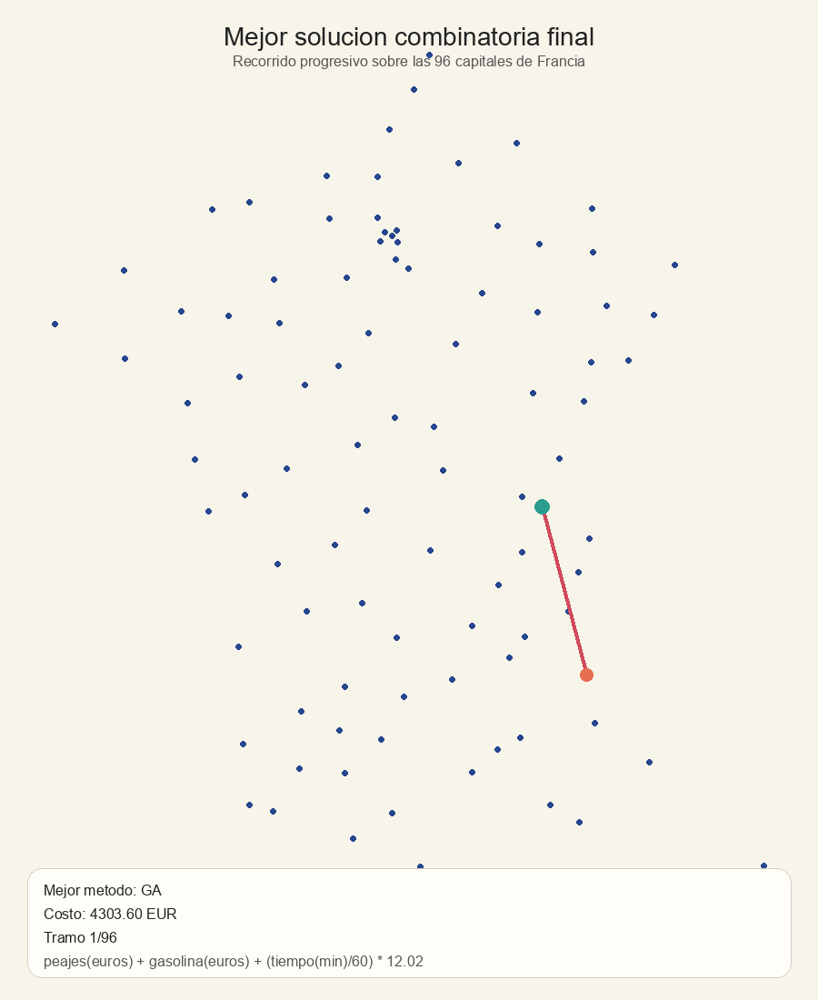
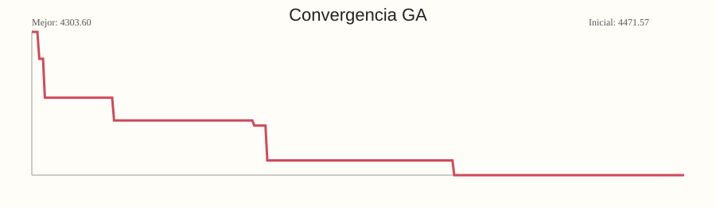
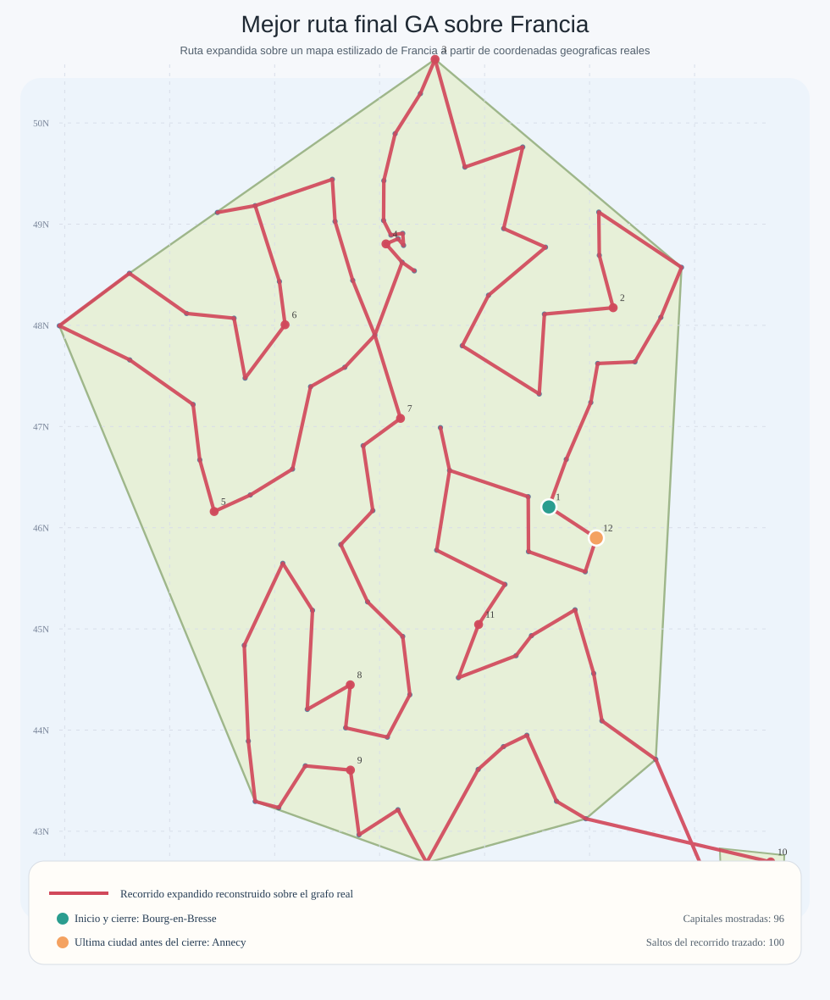

# Parte 2: Optimizacion Combinatoria (TSP - 96 Departamentos de Francia)

## 3.1 Descripcion del problema

En la segunda parte del trabajo se aborda una variante del **Problema del Viajante (TSP)** aplicada al recorrido de las **96 capitales departamentales de Francia metropolitana**. El objetivo consiste en encontrar un orden de visita para todas las ciudades tal que se minimice el costo total del recorrido, cumpliendo la condicion clasica del TSP: cada ciudad debe visitarse exactamente una vez y, al finalizar, se debe completar el circuito regresando al punto de partida o cerrando la gira definida para la evaluacion. Debido a que el numero de rutas posibles crece de forma factorial con respecto al numero de ciudades, se trata de un problema combinatorio de muy alta complejidad, para el cual resulta poco practico aplicar metodos exactos en tiempos razonables.

En este contexto, cada solucion candidata puede representarse como una permutacion de las 96 ciudades, donde el orden de los elementos define la ruta seguida por el vendedor. A partir de esa secuencia se calcula la distancia total recorrida y, con ella, el costo economico asociado al viaje. De esta manera, el problema no se limita a encontrar la ruta mas corta en kilometros, sino la ruta de **menor costo total**, incorporando factores operativos mas cercanos a una situacion real de desplazamiento.

La funcion objetivo utilizada considera tres componentes principales. El primero es el **costo del tiempo del vendedor**, calculado a partir de la duracion estimada del recorrido y una tarifa horaria fija. El segundo corresponde a los **peajes**, que dependen de los tramos recorridos y se acumulan a lo largo de la ruta. El tercero es el **costo de combustible**, estimado segun la distancia total y el vehiculo seleccionado para realizar el viaje, ya que cada tipo de vehiculo presenta un consumo y un costo operativo diferente. En forma general, el costo total puede expresarse como:

$$
\text{Costo total} = \text{Costo por tiempo} + \text{Costo por peajes} + \text{Costo por combustible}
$$

donde:

$$
\text{Costo por tiempo} = (\text{horas totales del recorrido}) \times (\text{tarifa por hora})
$$

$$
\text{Costo por combustible} = (\text{distancia total recorrida}) \times (\text{costo por kilometro del vehiculo})
$$

Bajo esta formulacion, el reto de optimizacion consiste en explorar un espacio enorme de posibles recorridos y encontrar una ruta que balancee de manera eficiente distancia, tiempo y costo monetario. Esto hace que el problema sea especialmente adecuado para el uso de metaheuristicas, ya que estos metodos permiten aproximar soluciones de alta calidad en escenarios donde la busqueda exhaustiva resulta inviable.

## 3.2 Construccion y preprocesamiento de datos

La construccion del conjunto de datos para esta parte del trabajo se realizo en varias etapas. Primero, se extrajeron las coordenadas geograficas de las ciudades desde el sitio web [GeoKeo](https://geokeo.com/database/town/fr/23/), tomando como referencia las capitales departamentales de Francia. A partir de estas coordenadas se genero una primera estructura de conexiones entre ciudades cercanas, utilizada como base para construir un grafo inicial de rutas, el cual fue exportado a un archivo CSV para facilitar su revision posterior.

Posteriormente, este grafo fue ajustado y validado manualmente con apoyo de visualizaciones sobre mapa, con el fin de identificar conexiones plausibles dentro de la red y corregir aquellas que no representaban trayectos razonables. Esta etapa fue importante porque la cercania geografica por si sola no garantiza que dos ciudades esten conectadas por una ruta real o conveniente dentro de la red vial.

Una vez consolidada esta red base, se realizo el proceso de `web scraping` sobre el sitio [VINCI Autoroutes](https://www.vinci-autoroutes.com/fr/mon-trajet/), utilizando las rutas previamente definidas para consultar y completar informacion real de los trayectos. En particular, para cada conexion se obtuvo la distancia recorrida, el tiempo estimado de viaje y el valor de los peajes. Para mantener consistencia en la recoleccion de la informacion, en VINCI Autoroutes se utilizo la categoria **Clase 1 - Vehiculos ligeros**, correspondiente a automoviles particulares y vehiculos de uso ligero. Estos datos sirvieron como base para estructurar el conjunto final utilizado en la optimizacion combinatoria.

<a href="notebooks/combinatoria/00_construccion_grafo_inicial.ipynb" class="notebook-card-link">
  <span class="notebook-card-icon">
    <svg width="24" height="24" viewBox="0 0 64 64" fill="none" aria-hidden="true">
      <ellipse cx="32" cy="32" rx="17" ry="10.5" stroke="#f37726" stroke-width="4.5"></ellipse>
      <circle cx="50.5" cy="21" r="3.2" fill="#9e9e9e"></circle>
      <circle cx="13.5" cy="43" r="3.2" fill="#9e9e9e"></circle>
    </svg>
  </span>
  <span class="notebook-card-title">Cuaderno de construccion inicial del grafo</span>
</a>

## 3.3 Algoritmos utilizados

Para resolver este problema se emplearon dos metaheuristicas clasicas para optimizacion combinatoria: **Colonia de Hormigas (ACO)** y **Algoritmos Geneticos (GA)**. La eleccion de estos metodos responde a que ambos estan diseniados para explorar espacios de busqueda discretos muy grandes y han mostrado buen desempeno en variantes del TSP. Ademas, permiten balancear de manera flexible los procesos de exploracion y explotacion, lo cual es importante cuando se busca escapar de soluciones pobres sin perder la capacidad de refinar rutas prometedoras.

### Colonia de Hormigas (ACO)

El algoritmo de colonia de hormigas construye soluciones de manera progresiva, simulando el comportamiento colectivo de hormigas que depositan feromonas sobre los caminos recorridos. En cada iteracion, varias hormigas generan rutas completas entre las ciudades, eligiendo el siguiente nodo con base en una combinacion entre la **feromona acumulada** y una **heuristica local** asociada al inverso del costo entre ciudades. Con el paso de las iteraciones, las rutas de menor costo reciben mayor refuerzo y tienden a guiar la busqueda hacia regiones mas prometedoras del espacio de soluciones.

En la implementacion utilizada se fijaron los siguientes parametros:

- numero de hormigas: `40`
- numero de iteraciones: `250`
- importancia de la feromona (`alpha`): `1.0`
- importancia de la heuristica (`beta`): `3.0`
- tasa de evaporacion: `0.35`
- factor de intensificacion: `2.0`
- peso elitista para reforzar la mejor ruta global: `2.0`
- semilla aleatoria: `42`

Estos valores permiten dar mayor peso a la informacion heuristica del costo entre ciudades, sin eliminar la influencia del aprendizaje colectivo por feromonas. La evaporacion evita que la busqueda se estanque demasiado pronto en rutas suboptimas, mientras que el refuerzo elitista ayuda a conservar y explotar la mejor solucion global encontrada hasta cada iteracion.

### Algoritmos Geneticos (GA)

El algoritmo genetico aborda el problema manteniendo una **poblacion de rutas candidatas** que evoluciona a lo largo de varias generaciones. Cada individuo representa un recorrido completo por las ciudades, y su aptitud se evalua con el costo total de la ruta. A partir de esta evaluacion, se seleccionan las mejores soluciones para producir descendencia mediante operadores de cruce y mutacion. De este modo, el metodo combina informacion de rutas de buena calidad y genera nuevas alternativas que pueden mejorar progresivamente el resultado obtenido.

En este trabajo, el GA se implemento con una estrategia de **seleccion por torneo**, **cruce ordenado** y **mutacion por intercambio** de posiciones dentro de la ruta. Ademas, se permitio inyectar como semilla inicial la mejor ruta producida por ACO, con el fin de aprovechar una buena solucion de partida y refinarla en una fase evolutiva posterior.

Los parametros usados fueron:

- tamano de poblacion: `180`
- numero de generaciones: `350`
- tasa de mutacion: `0.12`
- tasa de cruce: `0.9`
- numero de individuos elitistas preservados por generacion: `12`
- tamano del torneo de seleccion: `5`
- uso de semilla inicial proveniente de ACO: `True`
- semilla aleatoria: `42`

La justificacion de esta configuracion es que una poblacion relativamente amplia favorece la diversidad de soluciones, mientras que una tasa de cruce alta promueve la recombinacion de rutas prometedoras. La mutacion moderada introduce variacion sin destruir excesivamente las estructuras utiles encontradas, y el elitismo garantiza que las mejores soluciones no se pierdan entre generaciones.

En conjunto, ACO y GA ofrecen dos perspectivas complementarias sobre el mismo problema. ACO destaca por su capacidad para construir soluciones guiadas por memoria colectiva y heuristicas locales, mientras que GA resulta util para recombinar y refinar soluciones ya competitivas dentro de una poblacion diversa. Esta combinacion permite comparar estrategias de busqueda distintas e incluso aprovechar la salida de un metodo como punto de partida para el otro.

## 3.4 Resultados

Los experimentos realizados sobre la instancia de las 96 capitales departamentales muestran que ambos metodos fueron capaces de producir recorridos validos y de costo competitivo. Sin embargo, el mejor resultado final fue alcanzado por el **algoritmo genetico (GA)**, que logro refinar la solucion inicial y obtener un costo total inferior al conseguido por la colonia de hormigas.

La comparacion final entre metodos puede resumirse en la siguiente tabla:

| Metodo | Mejor costo del tour (EUR) | Diferencia frente al mejor (EUR) | Iteraciones / generaciones | Tamano de busqueda |
|---|---:|---:|---:|---:|
| GA | 4303.602999 | 0.000000 | 350 | 180 |
| ACO | 4471.569332 | 167.966333 | 250 | 40 |

El **costo total optimo encontrado** fue de **4303.602999 euros**, calculado con la funcion de costo definida a partir de peajes, combustible y tiempo del vendedor. Este resultado se obtuvo usando como vehiculo de referencia un **Renault Clio**, con combustible tipo gasolina, y una tarifa del vendedor de **12.02 euros por hora**, de acuerdo con la formulacion del modelo.

En cuanto a la comparacion entre metodos, ACO alcanzo un mejor costo de **4471.569332 euros**, mientras que GA obtuvo **4303.602999 euros**. En otras palabras, **GA mejoro a ACO en 167.966333 euros, equivalente a una mejora relativa de 3.7563 %**. Este comportamiento sugiere que ACO fue efectivo para construir una buena ruta inicial, pero que GA tuvo una mayor capacidad de refinamiento al recombinar y ajustar soluciones candidatas a lo largo de las generaciones.

La **mejor ruta encontrada** puede leerse de forma mas clara si se resume por tramos geograficos:

- inicio y arco mediterraneo: `Bourg-en-Bresse -> Gap -> Ajaccio -> Bastia -> Nice -> Digne-les-Bains -> Toulon -> Marseille -> Avignon -> Nimes -> Montpellier -> Perpignan`
- suroccidente y eje atlantico: `Carcassonne -> Foix -> Auch -> Tarbes -> Pau -> Mont-de-Marsan -> Bordeaux -> Tours -> Blois -> Orleans -> Chartres -> Evreux -> Cergy -> Paris`
- region norte y noreste: `Creteil -> Bobigny -> Nanterre -> Versailles -> Evry-Courcouronnes -> Melun -> Auxerre -> Troyes -> Bar-le-Duc -> Chaumont -> Vesoul -> Besancon -> Belfort -> Colmar -> Strasbourg -> Epinal -> Nancy -> Metz -> Charleville-Mezieres -> Chalons-en-Champagne -> Laon -> Lille -> Arras -> Amiens -> Beauvais -> Rouen`
- occidente y regreso al centro-este: `Saint-Lo -> Caen -> Alencon -> Le Mans -> Angers -> Laval -> Rennes -> Saint-Brieuc -> Quimper -> Vannes -> Nantes -> La Roche-sur-Yon -> La Rochelle -> Niort -> Poitiers -> Angouleme -> Perigueux -> Agen -> Cahors -> Montauban -> Toulouse -> Albi -> Rodez -> Mende -> Aurillac -> Tulle -> Limoges -> Gueret -> Chateauroux -> Bourges -> Nevers -> Clermont-Ferrand -> Moulins -> Macon -> Lons-le-Saunier -> Dijon -> Annecy -> Chambery -> Grenoble -> Valence -> Privas -> Le Puy-en-Velay -> Saint-Etienne -> Lyon -> Bourg-en-Bresse`

En terminos cualitativos, los resultados muestran una dinamica complementaria entre ambos enfoques. ACO aporta una exploracion guiada por informacion local y memoria colectiva, lo que permite encontrar rapidamente rutas razonables en un espacio de busqueda muy grande. Por su parte, GA aprovecha esa base inicial y la mejora mediante operadores evolutivos, conservando buenas estructuras parciales y corrigiendo tramos menos eficientes del recorrido. Por esta razon, dentro de los experimentos realizados, **GA puede considerarse el metodo con mejor desempeno final** para esta instancia del problema.

## 3.5 Visualizacion

La visualizacion final se realiza sobre el mapa de **Francia**, mostrando el recorrido ganador obtenido por el algoritmo genetico. El GIF permite observar la progresion espacial del tour, mientras que la curva de convergencia muestra como el costo va disminuyendo a medida que avanzan las generaciones del metodo ganador.

### Comparacion visual de costos

```{python}
#| echo: false
#| warning: false
#| message: false

import matplotlib.pyplot as plt

methods = ["ACO", "GA"]
costs = [4471.569332, 4303.602999]
colors = ["#c96f2d", "#2d7fc9"]

fig, ax = plt.subplots(figsize=(7, 4))
bars = ax.bar(methods, costs, color=colors)
ax.set_title("Costo final por metodo")
ax.set_ylabel("Costo total (EUR)")
ax.grid(axis="y", alpha=0.25)

for bar, value in zip(bars, costs):
    ax.text(
        bar.get_x() + bar.get_width() / 2,
        value + 15,
        f"{value:.2f}",
        ha="center",
        va="bottom",
        fontsize=10,
    )

plt.tight_layout()
plt.show()
```

### GIF del mejor recorrido en Francia



### Curva de convergencia del metodo ganador



Como apoyo adicional, tambien se dispone de una visualizacion estatica del tour ganador, util para inspeccionar la forma general del recorrido sin necesidad de reproducir la animacion.


