# Parte 1: Optimización Numérica

## Funciones de prueba

Para evaluar el comportamiento de los métodos de optimización numérica, se seleccionaron varias funciones de prueba ampliamente utilizadas en la literatura. En conjunto, estas funciones benchmark ofrecen paisajes de optimización con propiedades diversas, como multimodalidad, distintos niveles de separabilidad y valles estrechos, por lo que constituyen una base adecuada para comparar la convergencia y la robustez de distintos algoritmos frente a problemas de diferente dificultad [@jamil2013].

### Función de Rosenbrock

La función de Rosenbrock es un caso clásico en optimización continua. Su principal dificultad es la presencia de un valle largo, curvo y angosto que conduce al mínimo global. Aunque la función no es extremadamente multimodal, muchos algoritmos tienen dificultades para avanzar de manera estable dentro de este valle y acercarse con precisión a la solución.

$$
f(x, y) = (1 - x)^2 + 100(y - x^2)^2
$$

Su mínimo global se encuentra en $(1,1)$, donde $f(x,y)=0$.

### Función de Rastrigin

La función de Rastrigin es ampliamente usada para evaluar algoritmos en escenarios multimodales. Su superficie contiene una gran cantidad de mínimos locales distribuidos periódicamente, lo que dificulta la búsqueda del mínimo global. Por esta razón, resulta muy útil para analizar la capacidad de exploración de un método de optimización.

$$
f(\mathbf{x}) = 10n + \sum_{i=1}^{n} \left(x_i^2 - 10 \cos(2\pi x_i)\right)
$$

Su mínimo global se encuentra en $\mathbf{x}=\mathbf{0}$, donde $f(\mathbf{x})=0$.

### Función de Schwefel

La función de Schwefel representa un reto importante debido a que su mínimo global está alejado del origen y la superficie presenta muchas irregularidades. Esto obliga a los algoritmos a explorar con cuidado el dominio de búsqueda y evita que una estrategia demasiado local encuentre con facilidad la mejor solución.

$$
f(\mathbf{x}) = 418.9829\,n - \sum_{i=1}^{n} x_i \sin\left(\sqrt{|x_i|}\right)
$$

Su mínimo global se alcanza aproximadamente cuando $x_i = 420.9687$ para todo $i$.

### Función de Griewank

La función de Griewank combina un crecimiento cuadrático moderado con un componente oscilatorio multiplicativo. Esta estructura genera varios mínimos locales, aunque de una forma menos agresiva que en Rastrigin. Por ello, es útil para estudiar el comportamiento de los algoritmos en superficies multimodales con una complejidad intermedia.

$$
f(\mathbf{x}) = 1 + \sum_{i=1}^{n}\frac{x_i^2}{4000} - \prod_{i=1}^{n}\cos\left(\frac{x_i}{\sqrt{i}}\right)
$$

Su mínimo global se encuentra en $\mathbf{x}=\mathbf{0}$, donde $f(\mathbf{x})=0$.

### Función de Goldstein-Price

La función de Goldstein-Price es una función bidimensional con una superficie compleja y altamente irregular. Presenta cambios pronunciados en la curvatura y varias zonas que pueden desviar la trayectoria de búsqueda, por lo que es adecuada para evaluar la precisión y estabilidad de los algoritmos en problemas no triviales.

$$
\begin{aligned}
f(x,y) &= \left[1 + (x+y+1)^2(19 - 14x + 3x^2 - 14y + 6xy + 3y^2)\right] \\
&\quad \cdot \left[30 + (2x-3y)^2(18 - 32x + 12x^2 + 48y - 36xy + 27y^2)\right]
\end{aligned}
$$

Su mínimo global se encuentra en $(0,-1)$, donde el valor de la función es $3$.

### Función Six-Hump Camel

La función Six-Hump Camel es otro ejemplo clásico en dos dimensiones. Su interés principal radica en que posee varios puntos críticos y dos mínimos globales simétricos. Esto permite evaluar si un algoritmo logra identificar soluciones equivalentes en distintas regiones del espacio de búsqueda.

$$
f(x,y) = \left(4 - 2.1x^2 + \frac{x^4}{3}\right)x^2 + xy + \left(-4 + 4y^2\right)y^2
$$

Sus mínimos globales se encuentran aproximadamente en $(0.0898,-0.7126)$ y $(-0.0898,0.7126)$.

### Gráficos de superficie y contorno

Para cada una de estas funciones se deben incluir dos tipos de visualización:

- un gráfico de superficie en 3D, para observar la forma general del paisaje de optimización
- un gráfico de contorno en 2D, para identificar valles, picos, mínimos locales y zonas de mayor dificultad

Estas figuras complementan la descripción matemática, ya que permiten entender visualmente por qué ciertas funciones favorecen la convergencia rápida y por qué otras representan un reto mayor para los algoritmos estudiados.

## Optimización con Descenso por Gradiente

Una vez definidas las funciones de prueba, el siguiente paso consiste en estudiar el comportamiento del descenso por gradiente sobre cada una de ellas. El descenso por gradiente es un método de optimización local que busca minimizar una función objetivo mediante actualizaciones sucesivas de la forma
$$
x_{k+1} = x_k - \alpha \nabla f(x_k),
$$
donde $x_k$ es la solución en la iteración $k$, $\alpha$ es la tasa de aprendizaje y $\nabla f(x_k)$ es el gradiente de la función objetivo evaluado en ese punto. En cada paso, el método avanza en la dirección opuesta al gradiente para reducir el valor de la función y aproximarse a un mínimo. Aunque suele ser eficiente en funciones suaves, su desempeño depende en gran medida de la geometría de la función objetivo y de la condición inicial elegida [@nocedal2006].

### Metodología

Para evaluar la estabilidad del método y evitar conclusiones basadas en una sola corrida, se realizaron múltiples ejecuciones con condiciones iniciales aleatorias. En cada experimento, el algoritmo parte de un punto inicial generado dentro del dominio de la función. A partir de allí, se calcula el gradiente de la función objetivo para determinar la dirección de mayor descenso, y luego se actualiza iterativamente la solución. El criterio de parada se estableció mediante una tolerancia sobre la norma del cambio entre iteraciones, de modo que el algoritmo se detiene cuando dicho cambio es menor que 10^-6; en caso contrario, la corrida finaliza al alcanzar el número máximo de iteraciones definido para cada función.

El enunciado propone comparar corridas para $n = 100$, $500$ y $1000$. En los cuadernos de análisis se consolidaron resultados para varios casos en 2D y 3D, con énfasis en las funciones de Rosenbrock, Rastrigin, Schwefel, Griewank, Goldstein-Price y la función de las seis jorobas de camello, que pasaremos a llamar Six-Hump Camel. Además, el contenido se organizó en resúmenes por función, dimensión y número de corridas.

Este procedimiento permite observar no solo si el método encuentra soluciones cercanas al mínimo global, sino también con qué frecuencia lo hace, cuánta dispersión presentan los resultados finales y cuál es el costo computacional asociado.

### Visualización de la función objetivo

#### Rosenbrock

| Gradiente en 2D | Gradiente en 3D |
| :--- | :--- |
| $$ \nabla f(x, y) = \begin{bmatrix} -400x(y - x^2) - 2(1 - x) \\ 200(y - x^2) \end{bmatrix} $$ | $$ \nabla f(x, y, z) = \begin{bmatrix} -400x(y - x^2) - 2(1 - x) \\ 200(y - x^2) - 400y(z - y^2) - 2(1 - y) \\ 200(z - y^2) \end{bmatrix} $$ |

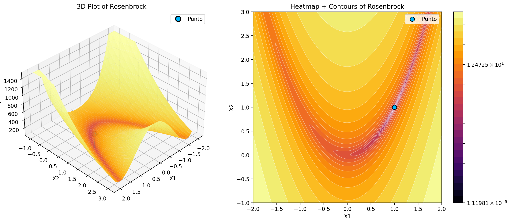

#### Rastrigin

| Gradiente en 2D | Gradiente en 3D |
| :--- | :--- |
| $$ \nabla f(x, y) = \begin{bmatrix} 2x + 20\pi \sin(2\pi x) \\ 2y + 20\pi \sin(2\pi y) \end{bmatrix} $$ | $$ \nabla f(x, y, z) = \begin{bmatrix} 2x + 20\pi \sin(2\pi x) \\ 2y + 20\pi \sin(2\pi y) \\ 2z + 20\pi \sin(2\pi z) \end{bmatrix} $$ |

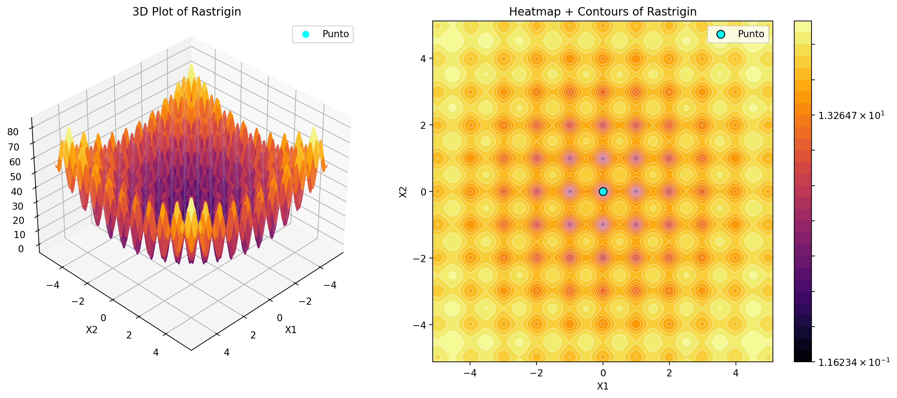

#### Schwefel

| Gradiente en 2D | Gradiente en 3D |
| :--- | :--- |
| $$ \nabla f(x, y) = \begin{bmatrix} -\sin\left(\sqrt{|x|}\right) - \frac{x \cos\left(\sqrt{|x|}\right)}{2\sqrt{|x|}} \\ -\sin\left(\sqrt{|y|}\right) - \frac{y \cos\left(\sqrt{|y|}\right)}{2\sqrt{|y|}} \end{bmatrix} $$ | $$ \nabla f(x, y, z) = \begin{bmatrix} -\sin\left(\sqrt{|x|}\right) - \frac{x \cos\left(\sqrt{|x|}\right)}{2\sqrt{|x|}} \\ -\sin\left(\sqrt{|y|}\right) - \frac{y \cos\left(\sqrt{|y|}\right)}{2\sqrt{|y|}} \\ -\sin\left(\sqrt{|z|}\right) - \frac{z \cos\left(\sqrt{|z|}\right)}{2\sqrt{|z|}} \end{bmatrix} $$ |

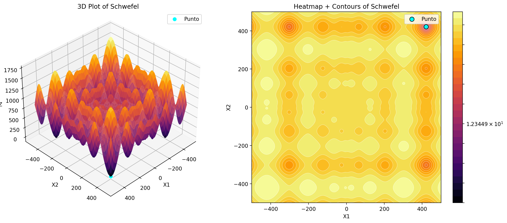

#### Griewank

| Gradiente en 2D | Gradiente en 3D |
| :--- | :--- |
| $$ \nabla f(x, y) = \begin{bmatrix} \frac{x}{2000} + \frac{1}{\sqrt{1}} \sin\left(\frac{x}{\sqrt{1}}\right) \cos\left(\frac{y}{\sqrt{2}}\right) \\ \frac{y}{2000} + \frac{1}{\sqrt{2}} \cos\left(\frac{x}{\sqrt{1}}\right) \sin\left(\frac{y}{\sqrt{2}}\right) \end{bmatrix} $$ | $$ \nabla f(x, y, z) = \begin{bmatrix} \frac{x}{2000} + \frac{1}{\sqrt{1}} \sin\left(\frac{x}{\sqrt{1}}\right) \cos\left(\frac{y}{\sqrt{2}}\right) \cos\left(\frac{z}{\sqrt{3}}\right) \\ \frac{y}{2000} + \frac{1}{\sqrt{2}} \cos\left(\frac{x}{\sqrt{1}}\right) \sin\left(\frac{y}{\sqrt{2}}\right) \cos\left(\frac{z}{\sqrt{3}}\right) \\ \frac{z}{2000} + \frac{1}{\sqrt{3}} \cos\left(\frac{x}{\sqrt{1}}\right) \cos\left(\frac{y}{\sqrt{2}}\right) \sin\left(\frac{z}{\sqrt{3}}\right) \end{bmatrix} $$ |

#### Goldstein-Price

| Gradiente en 2D |
| :--- |
| $$ \nabla f(x, y) = \begin{bmatrix} \frac{\partial f}{\partial x} \\ \frac{\partial f}{\partial y} \end{bmatrix} $$ |

#### Six-Hump Camel

| Gradiente en 2D |
| :--- |
| $$ \nabla f(x, y) = \begin{bmatrix} (8 - 8.4x^2 + 2x^4)x + y \\ x + (-8 + 16y^2)y \end{bmatrix} $$ |

### Tabla resumen de desempeño

A continuación se muestra el detalle específico de las funciones evaluadas en ambas dimensiones, o en una sola cuando corresponde. Esto permite observar con mayor claridad cómo cambia el desempeño del método cuando aumenta el número de corridas y cómo se distribuyen los resultados finales.

#### Rosenbrock

| Dimensión | Corridas | Mejor valor final | Peor valor final | Promedio del valor final | Mediana del valor final | Desv. del valor final | Promedio de evaluaciones | Promedio de iteraciones |
|---:|---:|---:|---:|---:|---:|---:|---:|---:|
| 2D | 100 | 0.00 | 5.20 | 2.27 | 1.86 | 1.71 | 1002.00 | 1000.00 |
| 2D | 500 | 0.00 | 5.65 | 1.49 | 0.75 | 1.65 | 1002.00 | 1000.00 |
| 2D | 1000 | 0.00 | 5.65 | 1.49 | 0.75 | 1.59 | 1002.00 | 1000.00 |
| 3D | 100 | 0.09 | 4.32 | 2.26 | 2.59 | 1.10 | 1002.00 | 1000.00 |
| 3D | 500 | 0.09 | 4.79 | 2.02 | 1.87 | 1.17 | 1002.00 | 1000.00 |
| 3D | 1000 | 0.03 | 4.79 | 2.03 | 2.18 | 1.17 | 1002.00 | 1000.00 |

Se evidencia que encuentra soluciones muy cercanas al óptimo en 2D, pero el valle estrecho y el acoplamiento en 3D dificultan ligeramente el desempeño promedio.

#### Rastrigin

| Dimensión | Corridas | Mejor valor final | Peor valor final | Promedio del valor final | Mediana del valor final | Desv. del valor final | Promedio de evaluaciones | Promedio de iteraciones |
|---:|---:|---:|---:|---:|---:|---:|---:|---:|
| 2D | 100 | 1.99 | 40.79 | 22.45 | 24.87 | 10.33 | 29.04 | 27.04 |
| 2D | 500 | 0.99 | 40.79 | 17.04 | 16.91 | 10.54 | 28.85 | 26.85 |
| 2D | 1000 | 0.99 | 40.79 | 16.48 | 16.91 | 10.58 | 29.05 | 27.05 |
| 3D | 100 | 1.99 | 58.70 | 31.95 | 35.32 | 13.04 | 30.10 | 28.10 |
| 3D | 500 | 1.99 | 58.70 | 22.71 | 21.39 | 12.31 | 31.92 | 29.92 |
| 3D | 1000 | 0.99 | 58.70 | 21.55 | 20.89 | 11.74 | 32.04 | 30.04 |

Se observa que sufre severamente debido a sus múltiples mínimos locales; converge rápido pero se evidencia que queda atrapado casi de inmediato.

#### Schwefel

| Dimensión | Corridas | Mejor valor final | Peor valor final | Promedio del valor final | Mediana del valor final | Desv. del valor final | Promedio de evaluaciones | Promedio de iteraciones |
|---:|---:|---:|---:|---:|---:|---:|---:|---:|
| 2D | 100 | -15.32 | 985.87 | 369.84 | 416.60 | 254.49 | 10002.00 | 10000.00 |
| 2D | 500 | -15.32 | 1225.63 | 430.81 | 401.60 | 317.57 | 10002.00 | 10000.00 |
| 2D | 1000 | -15.32 | 1225.63 | 376.59 | 341.46 | 291.55 | 10002.00 | 10000.00 |
| 3D | 100 | -7.73 | 1203.50 | 538.47 | 542.68 | 325.66 | 10002.00 | 10000.00 |
| 3D | 500 | -7.73 | 1450.16 | 650.61 | 660.48 | 354.56 | 10002.00 | 10000.00 |
| 3D | 1000 | -7.73 | 1450.16 | 565.92 | 517.55 | 351.71 | 10002.00 | 10000.00 |

Se denota un comportamiento muy polarizado y altamente dependiente del punto inicial; se evidencia que consume el total de las iteraciones con una desviación estándar altísima.

#### Griewank

| Dimensión | Corridas | Mejor valor final | Peor valor final | Promedio del valor final | Mediana del valor final | Desv. del valor final | Promedio de evaluaciones | Promedio de iteraciones |
|---:|---:|---:|---:|---:|---:|---:|---:|---:|
| 2D | 100 | 0.00 | 0.05 | 0.02 | 0.01 | 0.01 | 1766.94 | 1764.94 |
| 2D | 500 | 0.00 | 0.05 | 0.02 | 0.03 | 0.01 | 1732.03 | 1730.03 |
| 2D | 1000 | 0.00 | 0.05 | 0.02 | 0.03 | 0.01 | 1741.05 | 1739.05 |
| 3D | 100 | 0.01 | 0.99 | 0.04 | 0.03 | 0.10 | 2002.00 | 2000.00 |
| 3D | 500 | 0.01 | 0.99 | 0.04 | 0.03 | 0.04 | 2002.00 | 2000.00 |
| 3D | 1000 | 0.01 | 0.99 | 0.03 | 0.03 | 0.03 | 2002.00 | 2000.00 |

Se aprecia un desempeño sobresaliente y muy consistente; se demuestra que su estructura global guía con éxito al gradiente hacia valores cercanos a cero con mínima dispersión.

#### Goldstein-Price

| Dimensión | Corridas | Mejor valor final | Peor valor final | Promedio del valor final | Mediana del valor final | Desv. del valor final | Promedio de evaluaciones | Promedio de iteraciones |
|---:|---:|---:|---:|---:|---:|---:|---:|---:|
| 2D | 100 | 10.49 | 988.65 | 148.95 | 62.27 | 264.29 | 5002.00 | 5000.00 |
| 2D | 500 | 10.49 | 989.72 | 288.42 | 80.68 | 361.56 | 5002.00 | 5000.00 |
| 2D | 1000 | 10.49 | 989.72 | 328.08 | 81.16 | 382.52 | 5002.00 | 5000.00 |

Se evidencia una alta inestabilidad y dependencia crítica del punto de partida; se observa que acierta solo si cae en la cuenca de atracción correcta, alcanzando errores cercanos a 1000.

#### Six-Hump Camel

| Dimensión | Corridas | Mejor valor final | Peor valor final | Promedio del valor final | Mediana del valor final | Desv. del valor final | Promedio de evaluaciones | Promedio de iteraciones |
|---:|---:|---:|---:|---:|---:|---:|---:|---:|
| 2D | 100 | -1.03 | 2.10 | -0.45 | -1.03 | 1.08 | 989.10 | 987.10 |
| 2D | 500 | -1.03 | 2.10 | -0.14 | -1.03 | 1.34 | 996.39 | 994.39 |
| 2D | 1000 | -1.03 | 2.10 | -0.11 | -1.03 | 1.37 | 986.34 | 984.34 |

Se constata que es muy estable y exitoso; se evidencia que su mediana se fija consistentemente en el óptimo global ($-1.03$) a pesar de sus mínimos secundarios.

### Histogramas de valor final

Los histogramas del valor final permiten visualizar la distribución de las soluciones obtenidas después de todas las corridas. Esta gráfica es especialmente importante porque muestra si el algoritmo converge repetidamente hacia una misma región del espacio de soluciones o si, por el contrario, termina en distintos mínimos locales según la inicialización.

Cuando la mayor parte de los valores finales se concentra cerca del mínimo global, se puede interpretar que el método es relativamente estable para esa función. En cambio, cuando la distribución es amplia, sesgada o presenta varios grupos, ello sugiere que el descenso por gradiente es sensible al punto inicial o que la función contiene regiones donde la búsqueda local no logra llegar siempre a la mejor solución.

#### Rosenbrock

##### 2D

##### 3D

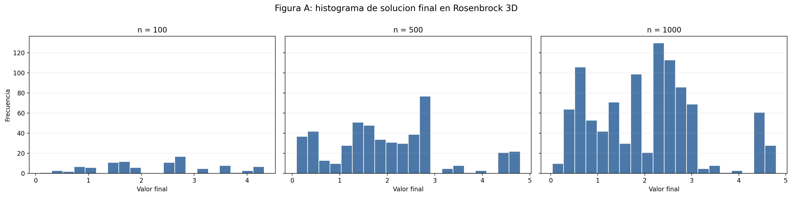

Se observa que en **Rosenbrock 2D**, los histogramas muestran una fuerte concentración de frecuencias en los valores cercanos a cero (especialmente a medida que aumentan las corridas $n = 500$ y $n = 1000$), lo que evidencia que el algoritmo logra converger exitosamente en repetidas ocasiones hacia la región del óptimo global, aunque persisten algunos valores dispersos debido a la dificultad de su valle parabólico. Por otro lado, en **Rosenbrock 3D**, se denota que la distribución se dispersa significativamente a lo largo del eje de valores finales y aparecen múltiples grupos de frecuencias separadas; esto evidencia que el incremento dimensional amplifica la sensibilidad al punto inicial, provocando que el descenso por gradiente termine con mayor frecuencia en distintas regiones o sub-óptimos locales en lugar de consolidarse en una única zona de convergencia.

#### Rastrigin

##### 2D

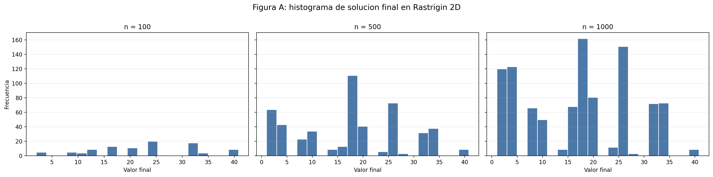

##### 3D

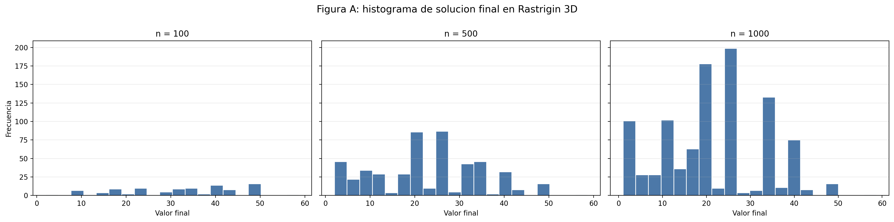

Se observa que en **Rastrigin 2D**, los histogramas muestran múltiples grupos de frecuencia distribuidos en diversos rangos de valores finales (con picos notables alrededor de los rangos de 0-5 y 15-20), lo que evidencia que el algoritmo es altamente sensible a la inicialización y se estanca frecuentemente en diferentes mínimos locales. Por su parte, en **Rastrigin 3D**, se denota que la distribución se amplía y desplaza hacia valores finales más altos, dispersando las frecuencias a lo largo de un espectro más amplio; esto evidencia que el aumento de dimensionalidad incrementa exponencialmente la cantidad de trampas multimodales, dificultando que el descenso por gradiente converja de manera consistente hacia el óptimo global.

#### Schwefel

##### 2D

##### 3D

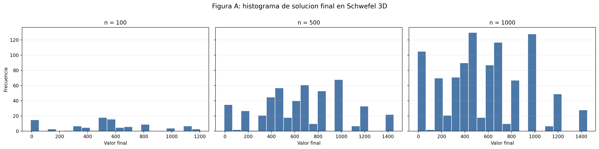

Se observa que en **Schwefel 2D**, los histogramas muestran una dispersión muy amplia de las frecuencias a lo largo de un gran rango de valores finales (con concentraciones intermedias y altas cifras que superan los 1000), lo que evidencia que el algoritmo es sumamente inestable y depende críticamente del punto de inicialización. Por otro lado, en **Schwefel 3D**, se denota que la distribución se desplaza aún más hacia la derecha y amplía su dispersión alcanzando valores finales cercanos a 1400; esto evidencia que la severa complejidad de su paisaje sinusoidal y el incremento dimensional provocan que el descenso por gradiente quede atrapado de forma masiva en mínimos locales pobres en lugar de hallar el óptimo global.

#### Griewank

##### 2D

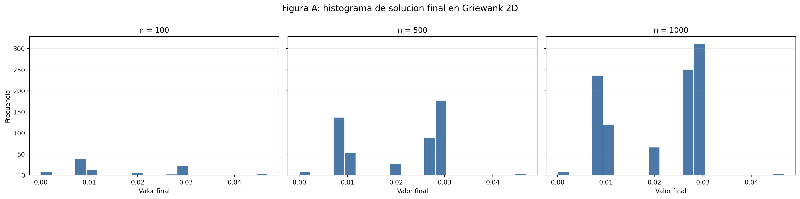

##### 3D

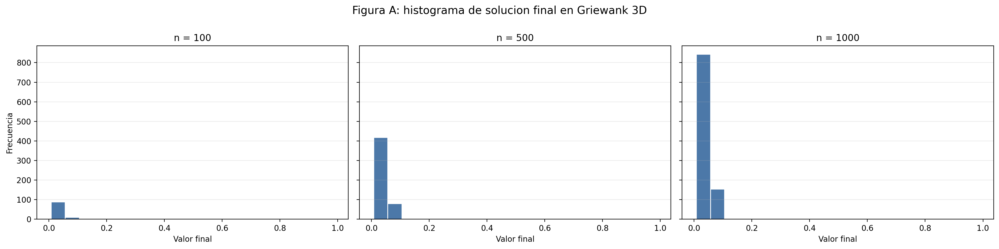

Se observa que en **Griewank 2D**, los histogramas muestran una concentración de frecuencias muy estrecha y compacta en valores extremadamente cercanos a cero (con un rango limitado que apenas alcanza los 0.05), lo que evidencia que el algoritmo posee una excelente consistencia y estabilidad para converger repetidamente cerca del óptimo global. Por otro lado, en **Griewank 3D**, se denota que las frecuencias se concentran fuertemente en el primer tramo inferior cercano a cero (con picos muy altos en las corridas de $n = 500$ y $n = 1000$), aunque con una ligera dispersión que se extiende hacia valores cercanos a 1.0; esto evidencia que, a pesar de un leve incremento en la variabilidad debido a la dimensión, la estructura global de la función permite que el descenso por gradiente mantenga una alta efectividad y robustez en la búsqueda de la solución.

#### Goldstein-Price

##### 2D

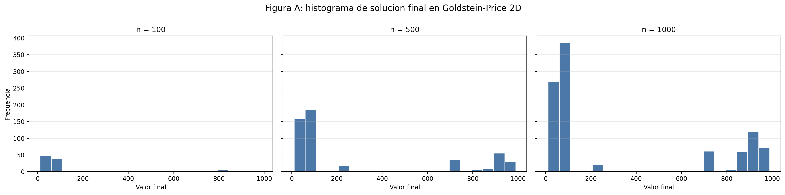

Se observa que en **Goldstein-Price 2D**, los histogramas muestran una clara polarización de las frecuencias en dos extremos muy separados (con concentraciones en los valores bajos iniciales y grandes picos que rozan o alcanzan los 1000 en las corridas de $n = 500$ y $n = 1000$); esto evidencia una alta inestabilidad y dependencia crítica del punto de partida, lo que demuestra que el descenso por gradiente solo acierta y converge con éxito si cae exactamente dentro de la cuenca de atracción correcta, terminando en mínimos locales deficientes o divergiendo cuando esto no ocurre.

#### Six-Hump Camel

##### 2D

Se observa que en **Six-Hump Camel 2D**, los histogramas muestran una fuerte concentración de las frecuencias en el valor de -1.0 (el óptimo global) a lo largo de las distintas corridas ($n = 100$, $n = 500$ y $n = 1000$), complementada por un grupo secundario menor ubicado alrededor de 2.0; esto evidencia que el algoritmo es robusto y converge de manera mayoritaria hacia la mejor solución, a pesar de que la presencia de mínimos locales secundarios en su topología desvía ocasionalmente algunas ejecuciones hacia el otro valor final.

### Histogramas de evaluaciones

Además de la calidad de la solución, es fundamental medir cuántas evaluaciones de la función objetivo fueron necesarias para alcanzar el resultado final. Para ello se emplean histogramas del número de evaluaciones, que permiten estudiar la eficiencia del método en cada caso.

Estos histogramas muestran si la convergencia ocurre de manera uniforme o si existen corridas mucho más costosas que otras. Una distribución concentrada en valores bajos suele indicar una convergencia más predecible y económica. En cambio, una distribución dispersa o con cola larga sugiere que algunas ejecuciones requieren muchos más pasos para estabilizarse, lo cual puede estar asociado a zonas complicadas del paisaje de optimización.

La interpretación conjunta entre histogramas de valor final e histogramas de evaluaciones es especialmente importante: un método puede converger rápido pero hacia soluciones pobres, o puede requerir más evaluaciones para acercarse mejor al mínimo global. Por eso, ambos indicadores deben analizarse en conjunto y no por separado.

#### Rosenbrock

##### 2D

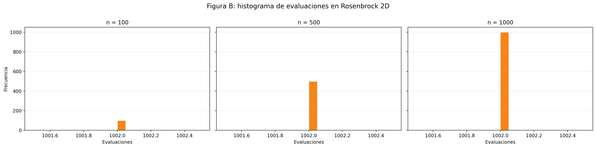

##### 3D

Se observa que en **Rosenbrock (tanto en 2D como en 3D)**, los histogramas muestran una frecuencia absoluta concentrada de manera idéntica en un único valor fijo de 1002 evaluaciones; esto evidencia un comportamiento de convergencia totalmente uniforme y predecible, indicando que el algoritmo consume siempre exactamente el mismo esfuerzo computacional para agotar o cumplir su criterio de parada sin importar el tamaño de las corridas.

#### Rastrigin

##### 2D

##### 3D

Se observa que en **Rastrigin 2D y 3D**, los histogramas muestran una distribución compacta y centrada de las frecuencias en un rango bajo de evaluaciones (principalmente entre 26 y 32 pasos), lo que evidencia que el algoritmo converge de manera muy rápida y predecible; sin embargo, en 3D se denota una ligera extensión hacia la derecha con frecuencias más dispersas, lo que evidencia que el aumento de dimensionalidad incrementa ligeramente el esfuerzo computacional y la variabilidad en algunas ejecuciones debido a los mínimos locales.

#### Schwefel

##### 2D

##### 3D

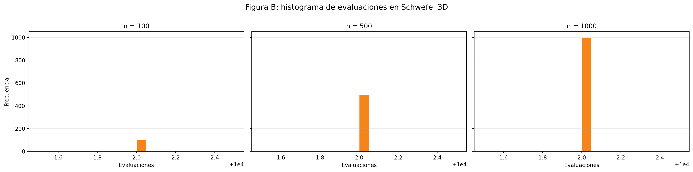

Se observa que en **Schwefel (tanto en 2D como en 3D)**, los histogramas muestran una frecuencia absoluta concentrada de manera idéntica en un único valor fijo de aproximadamente 20000 evaluaciones (el tope máximo configurado); esto evidencia un comportamiento de convergencia totalmente uniforme donde el algoritmo agota por completo sus iteraciones en todas las corridas, reflejando que no logra un criterio de parada temprano debido a la complejidad de su búsqueda.

#### Griewank

##### 2D

##### 3D

Se observa que en **Griewank 2D**, los histogramas muestran una distribución dispersa de las frecuencias a lo largo de un rango amplio de evaluaciones (con un grupo notable acumulándose cerca del límite superior de 2000 pasos), lo que evidencia que el algoritmo experimenta una variabilidad considerable en su esfuerzo computacional según la inicialización. Por otro lado, en **Griewank 3D**, se denota que la frecuencia se concentra de manera absoluta en un único valor fijo de aproximadamente 2002 evaluaciones en todas las corridas; esto evidencia que al incrementar la dimensión, el algoritmo consume siempre el tope máximo de pasos establecidos para cumplir su convergencia, volviéndose completamente uniforme en su costo computacional.

#### Goldstein-Price

##### 2D

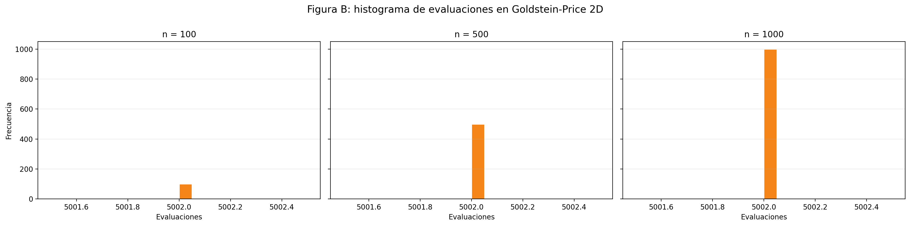

Se observa que en **Goldstein-Price 2D**, los histogramas muestran una frecuencia absoluta concentrada en un único valor fijo de 5002 evaluaciones, lo que evidencia que el algoritmo consume siempre el tope máximo de iteraciones de manera totalmente uniforme.

#### Six-Hump Camel

##### 2D

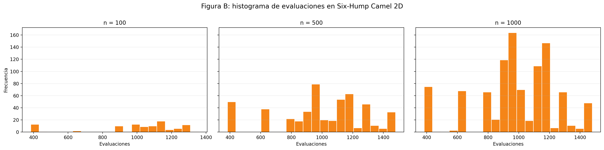

Se observa que en **Six-Hump Camel 2D**, los histogramas muestran una distribución dispersa y variada de las frecuencias a lo largo de un rango amplio de evaluaciones (concentrándose principalmente entre los 800 y 1300 pasos), lo que evidencia que el algoritmo experimenta un esfuerzo computacional heterogéneo y dependiente de la ruta de búsqueda inicial para alcanzar la convergencia.

### Conclusión Parcial 
En síntesis, el descenso por gradiente demostró ser un método eficiente y de bajo costo en términos de evaluaciones cuando se enfrenta a paisajes regulares (como Rosenbrock o zonas específicas de Griewank). Sin embargo, evidenció limitaciones severas en funciones altamente multimodales (Rastrigin y Schwefel) y superficies con valles complejos o dependencia crítica de la inicialización (Goldstein-Price), donde el algoritmo tiende a estancarse en mínimos locales deficientes o a consumir el tope máximo de iteraciones sin garantizar el óptimo global.

Estas limitaciones, derivadas de su naturaleza determinista y estrictamente local, justifican la transición hacia métodos heurísticos de búsqueda poblacional y estocástica, los cuales favorecen un mejor balance entre exploración y explotación del espacio de búsqueda y resultan especialmente útiles en problemas multimodales o con paisajes de optimización complejos [@talbi2009].

## Optimización con Métodos Heurísticos

Una vez analizado el descenso por gradiente, el siguiente paso consiste en estudiar métodos de optimización heurística que no dependan de información derivativa de la función objetivo. En esta parte se emplearon tres estrategias de búsqueda poblacional: **algoritmo evolutivo**, **optimización por enjambre de partículas (PSO)** y **evolución diferencial**. Estos métodos resultan especialmente útiles en funciones multimodales o con paisajes complejos, donde una estrategia puramente local puede quedar atrapada en mínimos no globales.

El objetivo de esta subsección es comparar la calidad de las soluciones obtenidas por estos métodos, así como su costo computacional medido en número de evaluaciones de la función objetivo. De esta manera, la discusión no se centra solo en quién alcanza el mejor valor final, sino también en qué tan robusto y eficiente resulta cada enfoque frente a funciones de distinta dificultad y dimensionalidad.

### Metodología

Para el experimento heurístico se evaluaron las funciones `Rosenbrock`, `Rastrigin`, `Schwefel` y `Griewank` en `2D` y `3D`. Adicionalmente, `Goldstein-Price` y `Six-Hump Camel` se trabajaron solo en `2D`, ya que en el proyecto fueron implementadas en su formulación clásica bidimensional. En todos los casos se realizaron varias corridas con semillas distintas, registrando el mejor valor encontrado, la mejor solución, el número de iteraciones y el número de evaluaciones de la función objetivo.

Los resultados consolidados de esta parte fueron generados desde el bloque `heuristicos/`, utilizando una implementación unificada para los tres métodos y un criterio consistente de conteo de evaluaciones. Esto permite realizar comparaciones directas entre algoritmos bajo condiciones experimentales equivalentes.

### Parámetros de los algoritmos

La configuración general utilizada para los experimentos heurísticos se resume a continuación, separando los parámetros de cada método para facilitar su lectura e interpretación.

#### Algoritmo evolutivo

| Parámetro | Valor |
|---|---:|
| Tamaño de población | 40 |
| Fracción de elitismo | 0.2 |
| Fracción de mutación | 0.1 |
| Máximo de iteraciones | 100 |

#### PSO

| Parámetro | Valor |
|---|---:|
| Número de partículas | 40 |
| Peso de inercia | 0.7 |
| Peso cognitivo | 1.5 |
| Peso social | 1.5 |
| Máximo de iteraciones | 100 |

#### Evolución diferencial

| Parámetro | Valor |
|---|---:|
| Tamaño de población | 40 |
| Factor de mutación | 0.8 |
| Tasa de cruce | 0.7 |
| Máximo de iteraciones | 100 |

### Tablas de resumen comparativo

La tabla principal de esta subsección debe consolidar, para cada función, dimensión y método, el mejor valor promedio, el mejor valor mínimo alcanzado y el promedio de evaluaciones realizadas. Esta tabla permite comparar de manera global tanto la calidad de las soluciones como el costo computacional.

La siguiente tabla fue construida a partir de `trabajo_carlos/1. optimizacion_numerica/heuristicos/datos/figuras/tabla_resumen_heuristicos.csv`.

| Función | Dimensión | Mejor método | Mejor valor mínimo | Mejor valor promedio | Promedio de evaluaciones |
|---|---|---|---|---|---|
| Rosenbrock | 2 | Evolución diferencial | 0.000000 | 0.000000 | 4840.0 |
| Rosenbrock | 3 | Evolución diferencial | 0.000002 | 0.000242 | 4840.0 |
| Rastrigin | 2 | Evolución diferencial | 0.000000 | 0.000000 | 4840.0 |
| Rastrigin | 3 | Evolución diferencial | 0.000002 | 0.038206 | 4840.0 |
| Schwefel | 2 | Evolución diferencial | 0.000025 | 0.000025 | 7050.0 |
| Schwefel | 3 | Evolución diferencial | 0.000038 | 0.000038 | 7050.0 |
| Griewank | 2 | PSO | 0.000000 | 0.002583 | 7050.0 |
| Griewank | 3 | PSO | 0.000000 | 0.009003 | 7050.0 |
| Goldstein-Price | 2 | Evolución diferencial | 3.000000 | 3.000000 | 4840.0 |
| Six-Hump Camel | 2 | PSO | -1.031628 | -1.031628 | 4840.0 |

En general, la tabla resume un patrón bastante claro: `Evolución diferencial` es el método más sólido en la mayoría de las funciones analizadas. En `Rosenbrock`, `Rastrigin`, `Schwefel` y `Goldstein-Price`, este método alcanza los mejores valores promedio y, al mismo tiempo, mantiene un costo computacional estable, lo que sugiere una buena combinación entre precisión y robustez frente a distintos paisajes de optimización.

Por su parte, `PSO` sobresale en `Griewank` y `Six-Hump Camel`. En estos casos logra los mejores valores promedio, lo que indica que su dinámica de exploración y ajuste colectivo se adapta especialmente bien a superficies con múltiples mínimos, pero con una estructura más favorable. Esto muestra que no existe un único método universalmente superior, aunque sí se observa una ventaja general de `Evolución diferencial` en los problemas más exigentes.

También se nota que la dimensión influye de manera importante en la dificultad. Al pasar de `2D` a `3D`, funciones como `Rosenbrock`, `Rastrigin`, `Schwefel` y `Griewank` presentan un deterioro en el valor promedio, lo que refleja que el aumento de dimensionalidad hace más compleja la búsqueda del óptimo global. Aun así, los métodos mejor posicionados conservan un desempeño competitivo, lo que refuerza la utilidad de estos enfoques heurísticos para problemas no convexos y multimodales.

En síntesis, los resultados sugieren que `Evolución diferencial` es la alternativa más consistente como método general, mientras que `PSO` puede ser preferible en funciones específicas donde la estructura del paisaje favorece su estrategia de búsqueda.

### Comparación gráfica de desempeño

Para evitar una presentación excesivamente fragmentada, en la parte heurística conviene resumir los resultados con unas pocas figuras comparativas de alto valor interpretativo. En lugar de repetir una gráfica por cada función y por cada método, es preferible usar figuras consolidadas que permitan identificar rápidamente tendencias generales.

### Comparación gráfica de la mediana del valor final

#### Función Rosenbrock
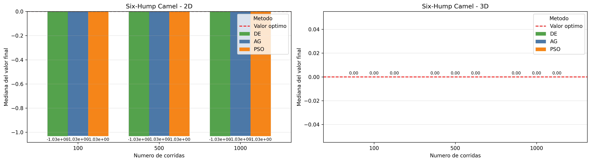

En `Rosenbrock`, `Evolución diferencial` logra los mejores resultados en `2D` y `3D`, con valores muy cercanos al óptimo. Al aumentar la dimensión, `PSO` y el `Algoritmo evolutivo` pierden algo de precisión.

#### Función Rastrigin
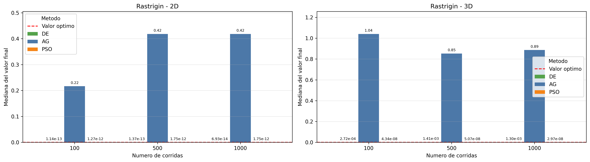

En `Rastrigin`, `Evolución diferencial` y `PSO` mantienen valores casi nulos en ambas dimensiones. El `Algoritmo evolutivo` muestra mayores dificultades, sobre todo en `3D`.

#### Función Schwefel
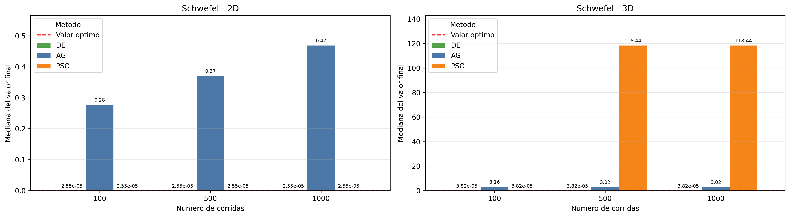

En `Schwefel`, `Evolución diferencial` es el método más estable y preciso en `2D` y `3D`. En cambio, `PSO` empeora con fuerza en `3D`, mostrando la mayor sensibilidad a la dimensión.

#### Función Griewank
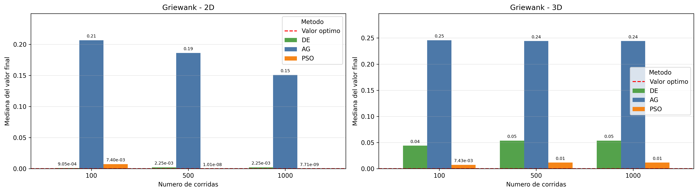

En `Griewank`, `PSO` presenta el mejor desempeño general, con valores más cercanos al óptimo en `2D` y `3D`. `Evolución diferencial` también responde bien, mientras que el `Algoritmo evolutivo` queda más rezagado.

#### Función Goldstein-Price
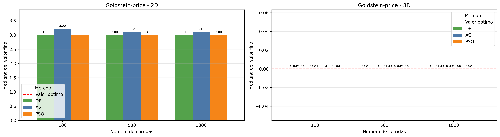

En `Goldstein-Price`, los tres métodos tienen resultados parecidos, aunque `Evolución diferencial` y `PSO` se mantienen más cerca del valor óptimo. El `Algoritmo evolutivo` presenta una precisión ligeramente menor.

#### Función Six-Hump Camel

En `Six-Hump Camel`, los tres métodos alcanzan resultados casi idénticos y muy cercanos al óptimo. Esto sugiere que la función puede resolverse con alta estabilidad sin grandes diferencias entre enfoques.

### Convergencia por función

#### Función Rosenbrock
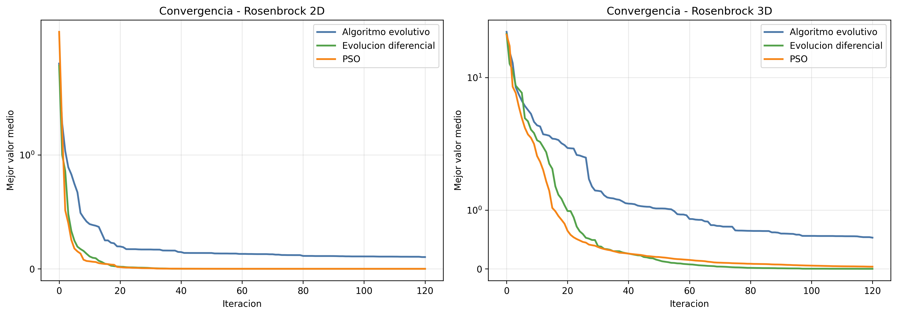

#### Función Schwefel
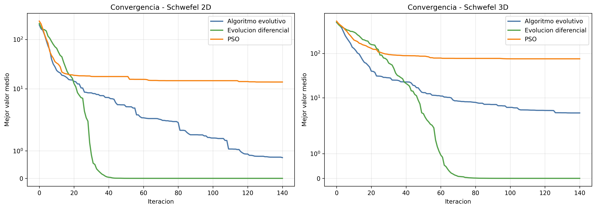

#### Función Rastrigin
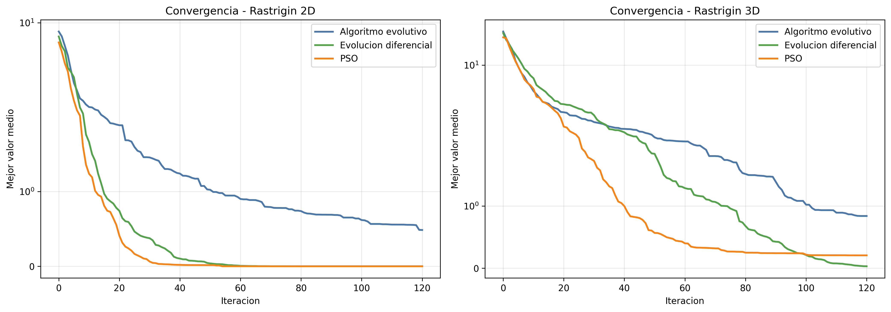

#### Función Griewank
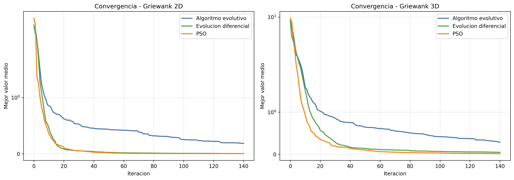

#### Función Goldstein-Price

#### Función Six-Hump Camel

En general, las curvas muestran que `Evolución diferencial` es el método más consistente, ya que converge con rapidez y suele terminar más cerca del óptimo en la mayoría de las funciones. `PSO` también presenta un muy buen desempeño, especialmente en `Rastrigin`, `Griewank` y `Six-Hump Camel`, donde desciende con rapidez y alcanza soluciones competitivas.

Por su parte, el `Algoritmo evolutivo` tiende a converger de forma más lenta y en varios casos queda más alejado del mejor valor final. En conjunto, los resultados refuerzan que `Evolución diferencial` y `PSO` ofrecen el comportamiento de convergencia más favorable dentro del estudio.

#### Conclusión Parcial

Los resultados obtenidos muestran que los métodos heurísticos evaluados son capaces de aproximarse con buena precisión a los óptimos de varias funciones de prueba, aunque su desempeño depende de la complejidad del paisaje y de la dimensión del problema. En general, `Evolución diferencial` fue el método más consistente, ya que alcanzó valores promedio de `0.000000` en `Rosenbrock 2D`, `Rastrigin 2D` y `Goldstein-Price 2D`, además de `0.000025` en `Schwefel 2D` y `0.000038` en `Schwefel 3D`.

Por su parte, `PSO` también presentó un comportamiento muy competitivo, especialmente en `Griewank`, donde obtuvo el mejor valor promedio con `0.002583` en `2D` y `0.009003` en `3D`, y en `Six-Hump Camel 2D`, donde igualó el mejor resultado con `-1.031628`. En contraste, el `Algoritmo evolutivo` mostró un desempeño más variable, con promedios más altos como `0.527946` en `Rosenbrock 3D`, `0.818432` en `Rastrigin 3D` y `4.713732` en `Schwefel 3D`.

Además, se observó que el aumento de dimensionalidad tiende a hacer más difícil la búsqueda del óptimo. Por ejemplo, en `Rosenbrock` el mejor promedio pasó de `0.000000` en `2D` a `0.000242` en `3D`, en `Rastrigin` de `0.000000` a `0.038206`, y en `Griewank` de `0.002583` a `0.009003`. Esto confirma que la complejidad del problema influye directamente en la estabilidad y eficacia de los métodos empleados.

En conjunto, el análisis confirma que los métodos heurísticos son una alternativa efectiva para problemas de optimización no lineal y multimodal, pero también evidencia que no existe un único enfoque universalmente superior para todos los casos. Aun así, dentro de este estudio, `Evolución diferencial` se perfila como la opción más robusta y equilibrada, mientras que `PSO` destaca en funciones específicas donde alcanza resultados iguales o incluso mejores.

## Comparación final entre métodos

Esta página está pensada para comparar los métodos **dentro del mismo caso**, no entre funciones distintas. La comparación correcta es:

- `Rosenbrock 2D y 3D`: comparación entre descenso por gradiente, algoritmo evolutivo, PSO y evolución diferencial
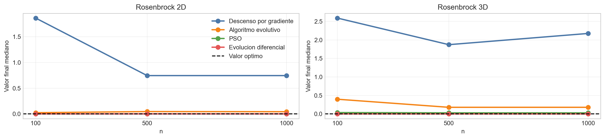
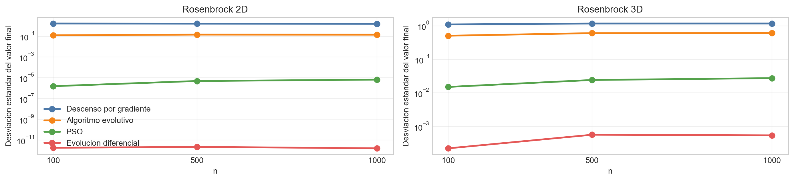

En la función Rosenbrock, PSO y, especialmente, Evolución diferencial muestran el mejor desempeño, ya que alcanzan valores finales medianos muy cercanos al óptimo tanto en 2D como en 3D y, además, presentan una variabilidad muy baja. 

El Algoritmo evolutivo se ubica en un nivel intermedio: mejora con claridad frente a Descenso por gradiente, pero todavía queda algo más alejado del valor óptimo, sobre todo en 3D. En cambio, Descenso por gradiente registra los valores finales más altos y una mayor dispersión, por lo que resulta ser el método menos preciso y menos estable en esta comparación.

- `Rastrigin 2D y 3D`: gradiente vs EA vs PSO vs DE
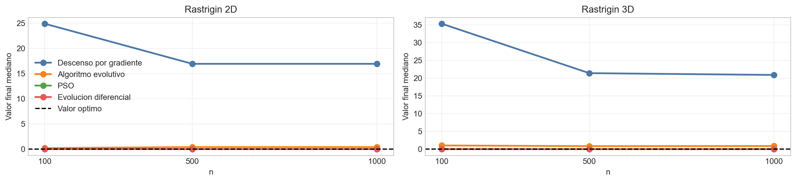
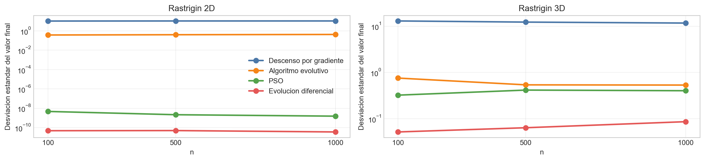

Para la función Rastrigin, la diferencia entre métodos es aún más evidente. Evolución diferencial y PSO vuelven a destacar como las alternativas más efectivas, al mantener valores finales muy próximos al óptimo y desviaciones reducidas, incluso cuando aumenta la dimensión del problema. 

El Algoritmo evolutivo ofrece un comportamiento aceptable, pero sigue mostrando una brecha frente a los mejores métodos. Por su parte, Descenso por gradiente presenta los peores resultados, con valores finales claramente más altos y una variabilidad mayor, lo que indica menor capacidad para converger de forma precisa en esta función.

- `Schwefel 2D y 3D`: gradiente vs EA vs PSO vs DE
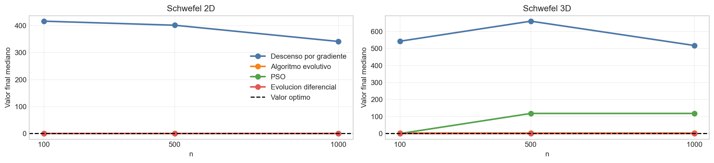
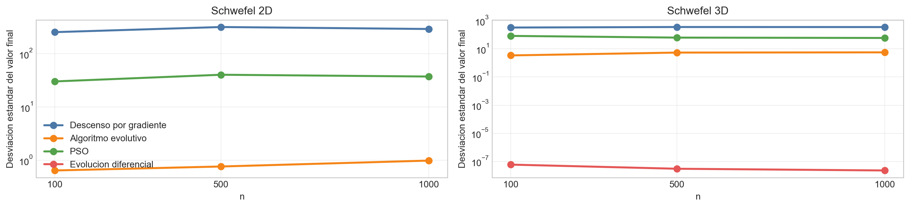

En la función Schwefel, `Evolución diferencial` es el método más sólido en ambas dimensiones, ya que mantiene valores finales medianos prácticamente sobre el óptimo y, además, exhibe la menor desviación entre todos los enfoques. El `Algoritmo evolutivo` también presenta un muy buen comportamiento, con resultados cercanos al óptimo y una variabilidad bastante baja, aunque sin alcanzar la consistencia de `DE`. En contraste, `PSO` y, sobre todo, `Descenso por gradiente` muestran un desempeño más débil: `PSO` se deteriora con claridad en 3D, mientras que `Descenso por gradiente` conserva los valores finales más altos y la mayor dispersión, por lo que resulta el método menos preciso y menos estable en esta comparación.

- `Griewank 2D y 3D`: gradiente vs EA vs PSO vs DE
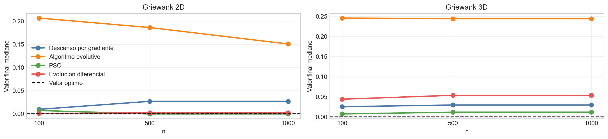
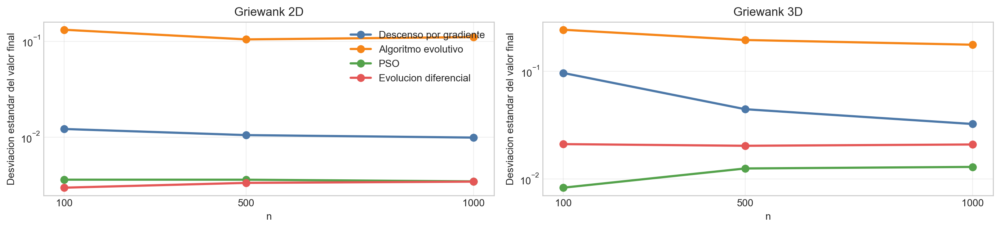

En la función Griewank se observa un comportamiento menos uniforme entre métodos que en los casos anteriores. En 2D, `Evolución diferencial` logra el mejor resultado, ya que se mantiene prácticamente sobre el óptimo y con la menor desviación, mientras que `PSO` también presenta un desempeño bastante sólido.  

En 3D, el método que mejor se comporta es `PSO`, porque alcanza los valores medianos más bajos y conserva una variabilidad reducida; `Evolución diferencial` se mantiene competitivo, aunque ya no domina con la misma claridad que en 2D. 

Por otro lado, el `Algoritmo evolutivo` es el más débil en ambas dimensiones, al registrar los valores finales más altos y la mayor dispersión, mientras que `Descenso por gradiente` queda en una posición intermedia.

- `Goldstein-Price 2D`: gradiente vs EA vs PSO vs DE

  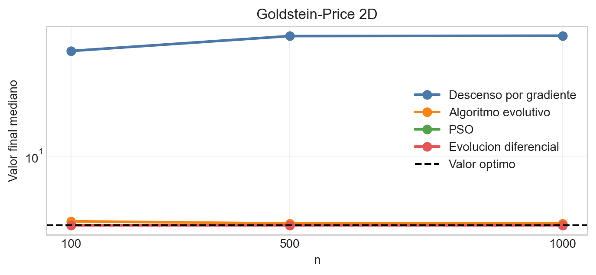
  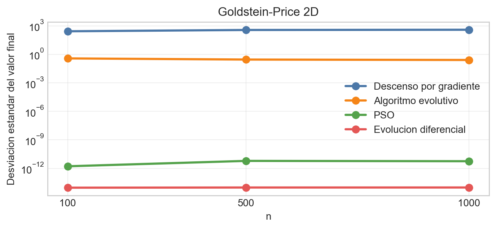

En la función `Goldstein-Price 2D`, `PSO` y `Evolución diferencial` muestran el mejor comportamiento, ya que alcanzan valores finales medianos prácticamente coincidentes con el óptimo y, además, presentan una variabilidad extremadamente baja. 
El `Algoritmo evolutivo` también logra aproximarse bien al valor óptimo, aunque con una dispersión mayor que estos dos métodos. En contraste, `Descenso por gradiente` es claramente el más débil, porque se mantiene muy alejado del óptimo y exhibe la mayor desviación, lo que refleja menor precisión y menor estabilidad.

- `Six-Hump Camel 2D`: gradiente vs EA vs PSO vs DE

  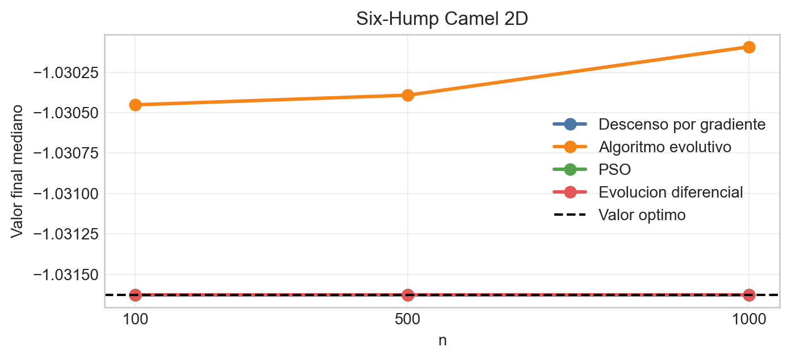
  

En la función `Six-Hump Camel 2D`, `PSO` y `Evolución diferencial` son los métodos más precisos, ya que se mantienen prácticamente sobre el valor óptimo y presentan una dispersión extremadamente baja. El `Algoritmo evolutivo` también logra resultados cercanos, aunque sus valores medianos quedan ligeramente por encima del óptimo y muestran una variabilidad mayor. 

Por su parte, `Descenso por gradiente` es el enfoque menos estable, al registrar con diferencia la desviación más alta entre todos los métodos comparados.

### Tabla comparativa global

| Caso | Mejor método en valor final o distancia al óptimo | Mejor método en evaluaciones |
|---|---|---|
| Goldstein-Price 2D | Evolución diferencial | Evolución diferencial |
| Griewank 2D | PSO | Descenso por gradiente |
| Griewank 3D | PSO | Descenso por gradiente |
| Rastrigin 2D | Evolución diferencial | Descenso por gradiente |
| Rastrigin 3D | Evolución diferencial | Descenso por gradiente |
| Rosenbrock 2D | Evolución diferencial | Descenso por gradiente |
| Rosenbrock 3D | Evolución diferencial | Descenso por gradiente |
| Schwefel 2D | Evolución diferencial | Evolución diferencial |
| Schwefel 3D | Evolución diferencial | Evolución diferencial |
| Six-Hump Camel 2D | PSO | Descenso por gradiente |

### Conteo global de victorias

Aquí se presenta un cierre simple contando cuántas veces ganó cada método.

| Método | Veces que ganó en calidad | Veces que ganó en evaluaciones |
|---|---:|---:|
| Gradiente | 0 | 7 |
| EA | 0 | 0 |
| PSO | 3 | 0 |
| DE | 7 | 3 |

### Conclusiones

#### **Conclusión 1: Mejor calidad de solución en los métodos heurísticos**  
En términos de calidad de solución, los métodos heurísticos dominaron la comparación: ganaron en los `10 de 10` casos analizados. Dentro de ese grupo, `Evolución diferencial` obtuvo el mejor resultado en `7` casos y `PSO` en `3`, mientras que `Algoritmo evolutivo` y `Descenso por gradiente` no lideraron ningún caso en esta métrica.

#### **Conclusión 2: Mayor eficiencia computacional del descenso por gradiente**  
En costo computacional, medido por el número de evaluaciones de la función objetivo, `Descenso por gradiente` fue el método más eficiente en `7 de 10` casos. Los `3` casos restantes fueron ganados por `Evolución diferencial`, lo que muestra que gradiente suele ser más barato, aunque no necesariamente el más preciso.

#### **Conclusión 3: Aporte comparado entre descenso por gradiente y métodos heurísticos**  
Los resultados muestran un patrón claro: los métodos heurísticos aportaron mejor precisión global, mientras que `Descenso por gradiente` aportó mayor rapidez en la mayoría de los casos. Además, `Evolución diferencial` fue el único método que logró combinar ambas ventajas en algunos problemas, siendo el mejor tanto en calidad como en evaluaciones en `3` casos: `Goldstein-Price 2D`, `Schwefel 2D` y `Schwefel 3D`.

### Animación representativa del método ganador

Como cierre visual de la comparación numérica, se incluye una animación de `evolución diferencial` sobre la función `Rastrigin 2D`. Este caso se eligió porque `DE` fue el método con mejor desempeño global en la comparación final y porque `Rastrigin` presenta una superficie altamente multimodal, con muchos mínimos locales, lo que permite visualizar con claridad la capacidad de exploración del algoritmo.

La animación resume de manera intuitiva por qué los métodos heurísticos, y en particular la evolución diferencial, pueden ofrecer ventajas frente a un método local cuando el paisaje de optimización es complejo, ya que fueron diseñados para la optimización global en espacios continuos y favorecen una exploración más robusta del espacio de búsqueda [@storn1997].

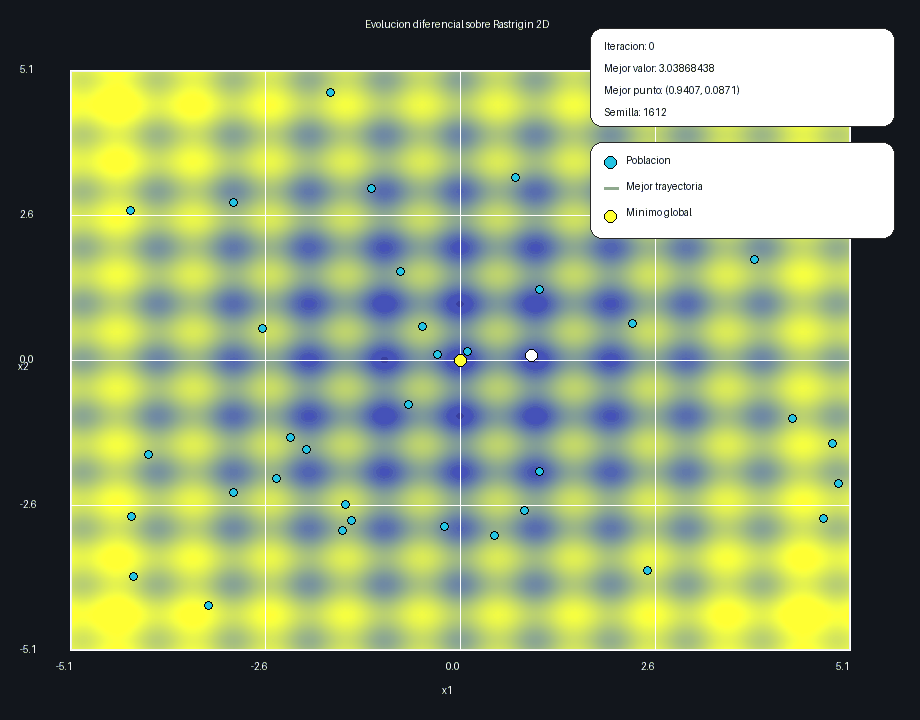

### Fuente de datos

Esta comparación debe salir de:

- [analisis_resultados.ipynb](notebooks/numerica/gradiente/analisis_resultados.ipynb)
- [analisis_resultados.ipynb](notebooks/numerica/heuristicos/analisis_resultados.ipynb)
- [12_comparacion_final_metodos.ipynb](notebooks/numerica/12_comparacion_final_metodos.ipynb)
