# Parte 1: Optimizacion Numerica

## 2.1 Funciones de prueba

Para evaluar el comportamiento de los metodos de optimizacion numerica, se seleccionaron varias funciones de prueba ampliamente utilizadas en la literatura. Estas funciones permiten estudiar paisajes de optimizacion con caracteristicas muy distintas, como valles estrechos, abundancia de minimos locales, oscilaciones periodicas y superficies altamente no lineales. Gracias a ello, sirven como una base adecuada para comparar el desempeno de distintos algoritmos y analizar tanto su capacidad de convergencia como su robustez frente a problemas de diferente dificultad.

### Funcion de Rosenbrock

La funcion de Rosenbrock es un caso clasico en optimizacion continua. Su principal dificultad es la presencia de un valle largo, curvo y angosto que conduce al minimo global. Aunque la funcion no es extremadamente multimodal, muchos algoritmos tienen dificultades para avanzar de manera estable dentro de este valle y acercarse con precision a la solucion.

$$
f(x, y) = (1 - x)^2 + 100(y - x^2)^2
$$

Su minimo global se encuentra en $(1,1)$, donde $f(x,y)=0$.

### Funcion de Rastrigin

La funcion de Rastrigin es ampliamente usada para evaluar algoritmos en escenarios multimodales. Su superficie contiene una gran cantidad de minimos locales distribuidos periodicamente, lo que dificulta la busqueda del minimo global. Por esta razon, resulta muy util para analizar la capacidad de exploracion de un metodo de optimizacion.

$$
f(\mathbf{x}) = 10n + \sum_{i=1}^{n} \left(x_i^2 - 10 \cos(2\pi x_i)\right)
$$

Su minimo global se encuentra en $\mathbf{x}=\mathbf{0}$, donde $f(\mathbf{x})=0$.

### Funcion de Schwefel

La funcion de Schwefel representa un reto importante debido a que su minimo global esta alejado del origen y la superficie presenta muchas irregularidades. Esto obliga a los algoritmos a explorar con cuidado el dominio de busqueda y evita que una estrategia demasiado local encuentre con facilidad la mejor solucion.

$$
f(\mathbf{x}) = 418.9829\,n - \sum_{i=1}^{n} x_i \sin\left(\sqrt{|x_i|}\right)
$$

Su minimo global se alcanza aproximadamente cuando $x_i = 420.9687$ para todo $i$.

### Funcion de Griewank

La funcion de Griewank combina un crecimiento cuadratico moderado con un componente oscilatorio multiplicativo. Esta estructura genera varios minimos locales, aunque de una forma menos agresiva que en Rastrigin. Por ello, es util para estudiar el comportamiento de los algoritmos en superficies multimodales con una complejidad intermedia.

$$
f(\mathbf{x}) = 1 + \sum_{i=1}^{n}\frac{x_i^2}{4000} - \prod_{i=1}^{n}\cos\left(\frac{x_i}{\sqrt{i}}\right)
$$

Su minimo global se encuentra en $\mathbf{x}=\mathbf{0}$, donde $f(\mathbf{x})=0$.

### Funcion de Goldstein-Price

La funcion de Goldstein-Price es una funcion bidimensional con una superficie compleja y altamente irregular. Presenta cambios pronunciados en la curvatura y varias zonas que pueden desviar la trayectoria de busqueda, por lo que es adecuada para evaluar la precision y estabilidad de los algoritmos en problemas no triviales.

$$
\begin{aligned}
f(x,y) &= \left[1 + (x+y+1)^2(19 - 14x + 3x^2 - 14y + 6xy + 3y^2)\right] \\
&\quad \cdot \left[30 + (2x-3y)^2(18 - 32x + 12x^2 + 48y - 36xy + 27y^2)\right]
\end{aligned}
$$

Su minimo global se encuentra en $(0,-1)$, donde el valor de la funcion es $3$.

### Funcion Six-Hump Camel

La funcion Six-Hump Camel es otro ejemplo clasico en dos dimensiones. Su interes principal radica en que posee varios puntos criticos y dos minimos globales simetricos. Esto permite evaluar si un algoritmo logra identificar soluciones equivalentes en distintas regiones del espacio de busqueda.

$$
f(x,y) = \left(4 - 2.1x^2 + \frac{x^4}{3}\right)x^2 + xy + \left(-4 + 4y^2\right)y^2
$$

Sus minimos globales se encuentran aproximadamente en $(0.0898,-0.7126)$ y $(-0.0898,0.7126)$.

### Graficos de superficie y contorno

Para cada una de estas funciones se deben incluir dos tipos de visualizacion:

- un grafico de superficie en 3D, para observar la forma general del paisaje de optimizacion
- un grafico de contorno en 2D, para identificar valles, picos, minimos locales y zonas de mayor dificultad

Estas figuras complementan la descripcion matematica, ya que permiten entender visualmente por que ciertas funciones favorecen la convergencia rapida y por que otras representan un reto mayor para los algoritmos estudiados.

## 2.2 Optimizacion con Descenso por Gradiente

Una vez definidas las funciones de prueba, el siguiente paso consiste en estudiar el comportamiento del descenso por gradiente sobre cada una de ellas. Este metodo actualiza iterativamente la solucion en la direccion opuesta al gradiente de la funcion objetivo, buscando reducir su valor de manera progresiva. Su mayor ventaja es que utiliza informacion local de la superficie para orientar la busqueda, lo que lo hace eficiente en problemas suaves o bien estructurados, aunque tambien lo vuelve sensible a la forma del paisaje y a la condicion inicial.

### Metodologia

Para evaluar la estabilidad del metodo y evitar conclusiones basadas en una sola corrida, se realizaron multiples ejecuciones con condiciones iniciales aleatorias. En cada experimento, el algoritmo parte de un punto inicial generado dentro del dominio de la funcion y luego avanza siguiendo la direccion de mayor descenso hasta alcanzar el criterio de parada establecido.

El enunciado propone comparar corridas para $n = 100$, $500$ y $1000$. En los cuadernos de analisis ya se consolidan especialmente resultados para varios casos en 2D y 3D, con enfasis en funciones como Rosenbrock, Schwefel y Rastrigin, y con resúmenes organizados por funcion, dimension y numero de corridas. Este procedimiento permite observar no solo si el metodo encuentra soluciones cercanas al minimo global, sino tambien con que frecuencia lo hace, cuanta dispersion presentan los resultados finales y cual es el costo computacional asociado.

En problemas de optimizacion no convexa este analisis es clave, porque una misma regla de actualizacion puede producir trayectorias muy distintas dependiendo del punto inicial y de la geometria local de la funcion.

### Visualización de la función objetivo

#### Rosenbrock
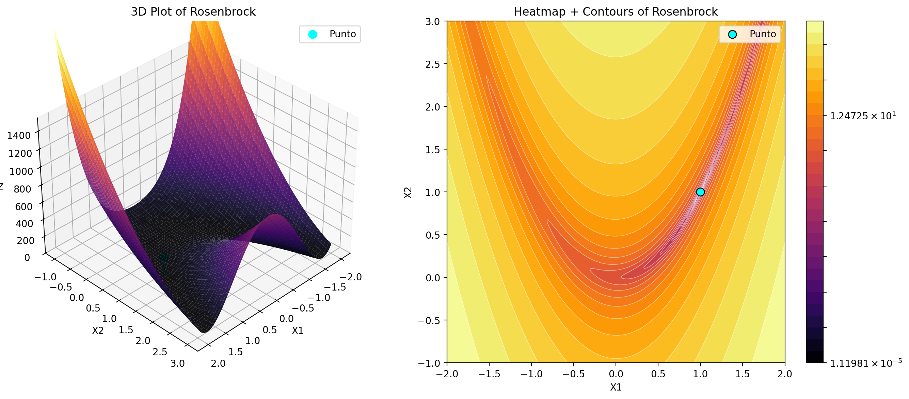

#### Rastrigin

#### Schwefel

#### Griewank
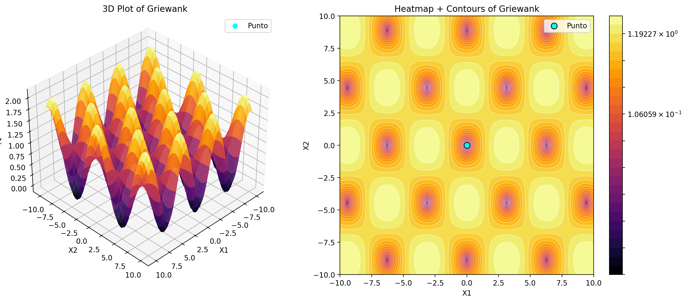

#### Goldstein-Price
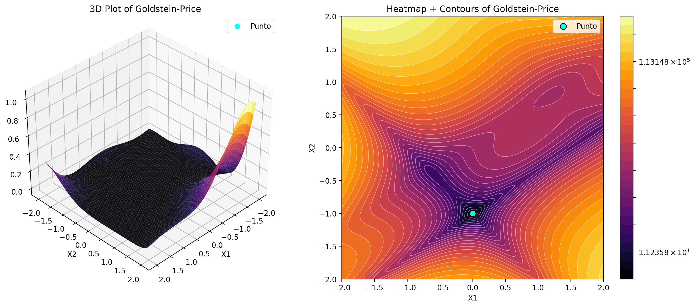

#### Six-Hump Camel
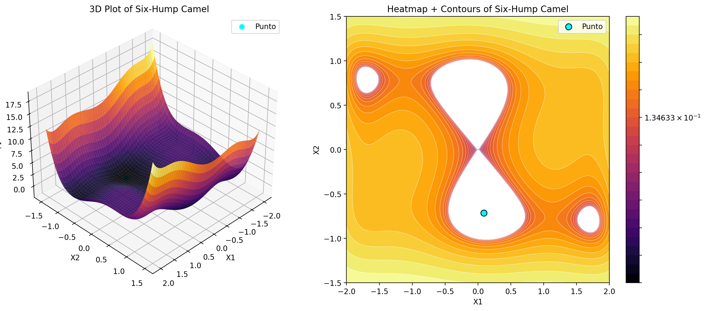

### Tabla resumen de desempeno

A continuacion se muestra el detalle especifico de las funciones evaluadas en ambas dimensiones o una dependiendo el caso. Esto nos permite leer mejor como cambia el desempeño del metodo cuando aumenta el numero de corridas y como se distribuyen los resultados finales.

#### Rosenbrock

| Corridas | Mejor valor final | Peor valor final | Promedio valor final | Mediana valor final | Desv. valor final | Promedio evaluaciones | Promedio iteraciones |
|---:|---:|---:|---:|---:|---:|---:|---:|
| 100 | 0.00 | 5.20 | 2.27 | 1.86 | 1.71 | 1002.00 | 1000.00 |
| 500 | 0.00 | 5.65 | 1.49 | 0.75 | 1.65 | 1002.00 | 1000.00 |
| 1000 | 0.00 | 5.65 | 1.49 | 0.75 | 1.59 | 1002.00 | 1000.00 |
| 100 | 0.09 | 4.32 | 2.26 | 2.59 | 1.10 | 1002.00 | 1000.00 |
| 500 | 0.09 | 4.79 | 2.02 | 1.87 | 1.17 | 1002.00 | 1000.00 |
| 1000 | 0.03 | 4.79 | 2.03 | 2.18 | 1.17 | 1002.00 | 1000.00 |

#### Rastrigin

| Corridas | Mejor valor final | Peor valor final | Promedio valor final | Mediana valor final | Desv. valor final | Promedio evaluaciones | Promedio iteraciones |
|---:|---:|---:|---:|---:|---:|---:|---:|
| 100 | 1.99 | 40.79 | 22.45 | 24.87 | 10.33 | 29.04 | 27.04 |
| 500 | 0.99 | 40.79 | 17.04 | 16.91 | 10.54 | 28.85 | 26.85 |
| 1000 | 0.99 | 40.79 | 16.48 | 16.91 | 10.58 | 29.05 | 27.05 |
| 100 | 1.99 | 58.70 | 31.95 | 35.32 | 13.04 | 30.10 | 28.10 |
| 500 | 1.99 | 58.70 | 22.71 | 21.39 | 12.31 | 31.92 | 29.92 |
| 1000 | 0.99 | 58.70 | 21.55 | 20.89 | 11.74 | 32.04 | 30.04 |

#### Schwefel

| Corridas | Mejor valor final | Peor valor final | Promedio valor final | Mediana valor final | Desv. valor final | Promedio evaluaciones | Promedio iteraciones |
|---:|---:|---:|---:|---:|---:|---:|---:|
| 100 | -15.32 | 985.87 | 369.84 | 416.60 | 254.49 | 10002.00 | 10000.00 |
| 500 | -15.32 | 1225.63 | 430.81 | 401.60 | 317.57 | 10002.00 | 10000.00 |
| 1000 | -15.32 | 1225.63 | 376.59 | 341.46 | 291.55 | 10002.00 | 10000.00 |
| 100 | -7.73 | 1203.50 | 538.47 | 542.68 | 325.66 | 10002.00 | 10000.00 |
| 500 | -7.73 | 1450.16 | 650.61 | 660.48 | 354.56 | 10002.00 | 10000.00 |
| 1000 | -7.73 | 1450.16 | 565.92 | 517.55 | 351.71 | 10002.00 | 10000.00 |

#### Griewank

| Corridas | Mejor valor final | Peor valor final | Promedio valor final | Mediana valor final | Desv. valor final | Promedio evaluaciones | Promedio iteraciones |
|---:|---:|---:|---:|---:|---:|---:|---:|
| 100 | 0.00 | 0.05 | 0.02 | 0.01 | 0.01 | 1766.94 | 1764.94 |
| 500 | 0.00 | 0.05 | 0.02 | 0.03 | 0.01 | 1732.03 | 1730.03 |
| 1000 | 0.00 | 0.05 | 0.02 | 0.03 | 0.01 | 1741.05 | 1739.05 |
| 100 | 0.01 | 0.99 | 0.04 | 0.03 | 0.10 | 2002.00 | 2000.00 |
| 500 | 0.01 | 0.99 | 0.04 | 0.03 | 0.04 | 2002.00 | 2000.00 |
| 1000 | 0.01 | 0.99 | 0.03 | 0.03 | 0.03 | 2002.00 | 2000.00 |

#### Goldstein-Price

| Corridas | Mejor valor final | Peor valor final | Promedio valor final | Mediana valor final | Desv. valor final | Promedio evaluaciones | Promedio iteraciones |
|---:|---:|---:|---:|---:|---:|---:|---:|
| 100 | 10.49 | 988.65 | 148.95 | 62.27 | 264.29 | 5002.00 | 5000.00 |
| 500 | 10.49 | 989.72 | 288.42 | 80.68 | 361.56 | 5002.00 | 5000.00 |
| 1000 | 10.49 | 989.72 | 328.08 | 81.16 | 382.52 | 5002.00 | 5000.00 |

#### Six-Hump Camel

| Corridas | Mejor valor final | Peor valor final | Promedio valor final | Mediana valor final | Desv. valor final | Promedio evaluaciones | Promedio iteraciones |
|---:|---:|---:|---:|---:|---:|---:|---:|
| 100 | -1.03 | 2.10 | -0.45 | -1.03 | 1.08 | 989.10 | 987.10 |
| 500 | -1.03 | 2.10 | -0.14 | -1.03 | 1.34 | 996.39 | 994.39 |
| 1000 | -1.03 | 2.10 | -0.11 | -1.03 | 1.37 | 986.34 | 984.34 |

### Histogramas de valor final

Los histogramas del valor final permiten visualizar la distribucion de las soluciones obtenidas despues de todas las corridas. Esta grafica es especialmente importante porque muestra si el algoritmo converge repetidamente hacia una misma region del espacio de soluciones o si, por el contrario, termina en distintos minimos locales segun la inicializacion.

Cuando la mayor parte de los valores finales se concentra cerca del minimo global, se puede interpretar que el metodo es relativamente estable para esa funcion. En cambio, cuando la distribucion es amplia, sesgada o presenta varios grupos, ello sugiere que el descenso por gradiente es sensible al punto inicial o que la funcion contiene regiones donde la busqueda local no logra llegar siempre a la mejor solucion.

En el reporte, estos histogramas deben acompaniarse con una breve lectura interpretativa, ya que no solo interesa mostrar la figura, sino explicar que revela sobre la robustez del metodo.

#### Rosenbrock

##### 2D

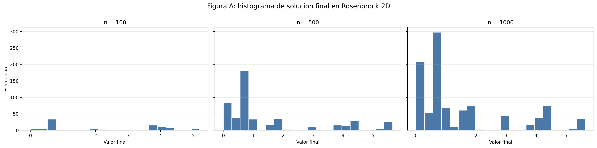

##### 3D

#### Rastrigin

##### 2D

##### 3D

#### Schwefel

##### 2D

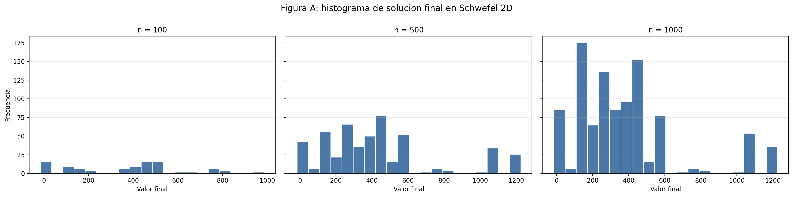

##### 3D

#### Griewank

##### 2D

##### 3D

#### Goldstein-Price

##### 2D

#### Six-Hump Camel

##### 2D

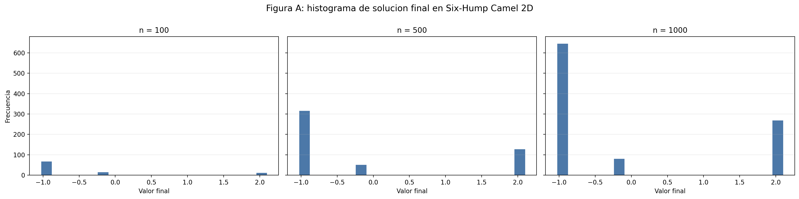

### Histogramas de evaluaciones

Ademas de la calidad de la solucion, es fundamental medir cuantas evaluaciones de la funcion objetivo fueron necesarias para alcanzar el resultado final. Para ello se emplean histogramas del numero de evaluaciones, que permiten estudiar la eficiencia del metodo en cada caso.

Estos histogramas muestran si la convergencia ocurre de manera uniforme o si existen corridas mucho mas costosas que otras. Una distribucion concentrada en valores bajos suele indicar una convergencia mas predecible y economica. En cambio, una distribucion dispersa o con cola larga sugiere que algunas ejecuciones requieren muchos mas pasos para estabilizarse, lo cual puede estar asociado a zonas complicadas del paisaje de optimizacion.

La interpretacion conjunta entre histogramas de valor final e histogramas de evaluaciones es especialmente importante: un metodo puede converger rapido pero hacia soluciones pobres, o puede requerir mas evaluaciones pero acercarse mejor al minimo global. Por eso, ambos indicadores deben analizarse en conjunto y no por separado.

#### Rosenbrock

##### 2D

##### 3D

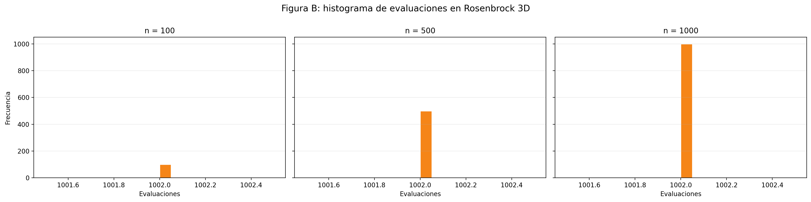

#### Rastrigin

##### 2D

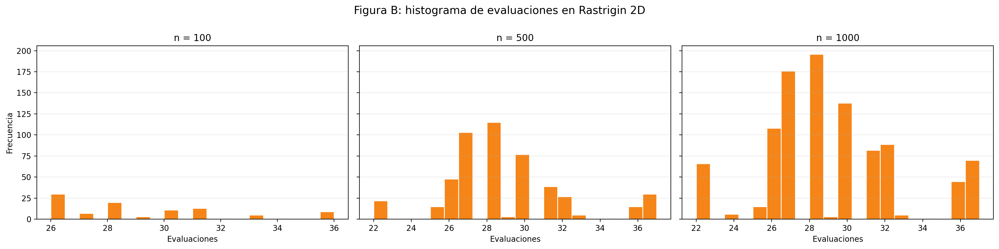

##### 3D

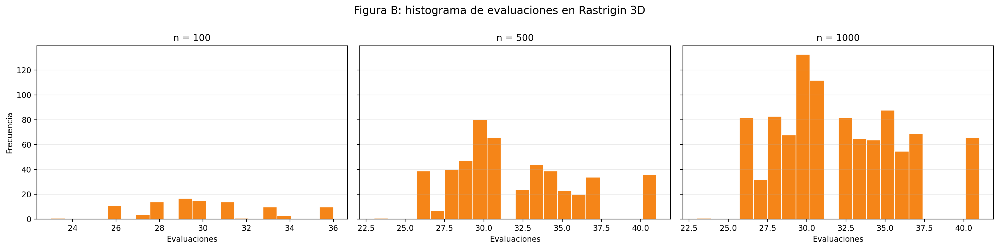

#### Schwefel

##### 2D

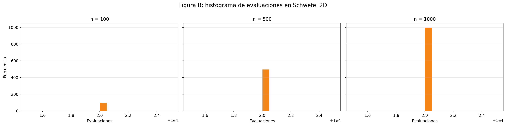

##### 3D

#### Griewank

##### 2D

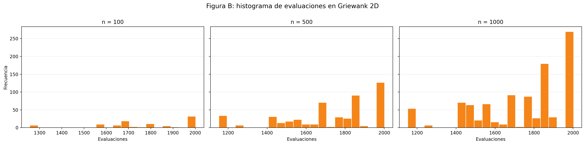

##### 3D

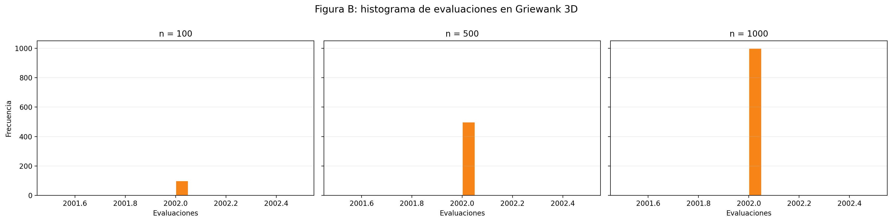

#### Goldstein-Price

##### 2D

#### Six-Hump Camel

##### 2D

### Resultados e interpretación por función

Los notebooks correspondientes al descenso por gradiente organizan el análisis según cada función de prueba, lo cual constituye una estructura adecuada para presentar los resultados en el informe. Cada función posee una geometría particular y, por lo tanto, plantea dificultades diferentes para el proceso de optimización.

El análisis de cada caso debe considerar principalmente la calidad de las soluciones encontradas, la variabilidad entre las corridas y el costo computacional, expresado mediante el número de evaluaciones realizadas. Los histogramas permiten observar la distribución de los valores finales y determinar si el algoritmo converge de manera consistente o si presenta una alta dependencia del punto inicial.

#### Rosenbrock

En `Rosenbrock`, el principal reto para el descenso por gradiente es la presencia de un valle estrecho y curvo que conduce al mínimo global. Aunque la función posee un único mínimo global, su geometría dificulta que el algoritmo avance directamente hacia él, debido a que la dirección del gradiente puede generar movimientos laterales o trayectorias en zigzag dentro del valle.

Los resultados muestran que el descenso por gradiente puede avanzar hacia regiones favorables y obtener soluciones cercanas al óptimo en algunas corridas. Sin embargo, el proceso puede ser lento y sensible tanto al punto inicial como al tamaño de paso utilizado. Pequeñas variaciones en estos elementos pueden provocar trayectorias ineficientes o hacer que el algoritmo requiera una gran cantidad de evaluaciones antes de detenerse.

En términos generales, la versión `2D` presenta un comportamiento más favorable que la versión `3D`, debido a que el aumento de la dimensionalidad introduce una mayor dificultad para recorrer correctamente el valle de la función. Por esta razón, aunque el método logra orientarse hacia el mínimo, su convergencia no siempre es rápida ni completamente robusta.

#### Schwefel

En `Schwefel`, el descenso por gradiente presenta una convergencia útil, pero poco robusta. El algoritmo alcanza soluciones relativamente buenas en el mejor caso, tanto en `2D` como en `3D`, lo que indica que puede aproximarse a regiones favorables de la función. Sin embargo, esta convergencia no es consistente entre las diferentes corridas, ya que los peores valores continúan siendo muy altos y los promedios permanecen alejados del mejor resultado observado.

Esta dificultad se relaciona con la estructura altamente multimodal de la función, la cual contiene numerosos mínimos locales alejados entre sí. Como consecuencia, el resultado final depende considerablemente del punto inicial, pues el algoritmo puede quedar atrapado en regiones que no corresponden al óptimo global.

Desde el punto de vista computacional, el costo es muy alto y completamente estable, debido a que el promedio de evaluaciones permanece fijo en todos los escenarios. Esto sugiere que, en la práctica, la mayoría de las corridas alcanza el límite máximo de iteraciones configurado, en lugar de detenerse como resultado de una convergencia clara.

En conjunto, `Schwefel 2D` presenta mejores promedios y una menor dispersión que `Schwefel 3D`. Por lo tanto, el paso a tres dimensiones empeora la calidad promedio de las soluciones y refuerza la idea de que esta función representa una prueba especialmente difícil para el descenso por gradiente.

#### Rastrigin

En `Rastrigin`, la presencia de una gran cantidad de mínimos locales convierte la función en una prueba exigente para cualquier método de optimización local. En este caso, los histogramas resultan especialmente útiles para identificar si el descenso por gradiente converge hacia diferentes mínimos o si los resultados se concentran cerca del óptimo global.

Los resultados muestran una convergencia parcial y claramente dependiente del punto inicial. El algoritmo logra encontrar soluciones relativamente cercanas al óptimo en el mejor caso, tanto en `2D` como en `3D`, lo que demuestra que puede aproximarse a mínimos bajos de la función. Sin embargo, este comportamiento no se presenta de manera sistemática, debido a que la superficie multimodal facilita que el método quede atrapado en diferentes mínimos locales.

En cuanto al costo computacional, el comportamiento es bajo y bastante estable en comparación con funciones como `Schwefel` o `Rosenbrock`. El promedio de evaluaciones se mantiene alrededor de `29` en `2D` y entre `30` y `32` en `3D`, lo que indica que el algoritmo se detiene con mayor rapidez.

En conjunto, `Rastrigin 2D` presenta mejores soluciones promedio, menor variabilidad y un costo computacional ligeramente inferior al de `Rastrigin 3D`. Aunque la versión tridimensional conserva un mejor caso competitivo, sus promedios son más altos y sus resultados presentan una mayor dispersión.

#### Griewank

En `Griewank`, aunque también existen múltiples mínimos locales, la estructura de la función es menos agresiva que la de `Rastrigin`. Esto permite estudiar un escenario intermedio en el que el descenso por gradiente enfrenta multimodalidad, pero sobre una superficie más regular.

Los resultados muestran una convergencia adecuada en comparación con las demás funciones del experimento. En `2D`, el mejor valor alcanza prácticamente el óptimo global, mientras que en `3D` también se obtienen soluciones muy cercanas. Además, los promedios permanecen bajos en ambos casos, especialmente en `2D`, lo que indica que el método logra encontrar con regularidad regiones favorables del espacio de búsqueda.

Respecto al costo computacional, el comportamiento es intermedio y estable. En `2D`, el promedio de evaluaciones se encuentra aproximadamente entre `1730` y `1767`, mientras que en `3D` permanece prácticamente fijo alrededor de `2002`. Esta estabilidad sugiere una influencia importante del criterio de parada configurado, especialmente en la versión tridimensional.

En conjunto, `Griewank 2D` presenta mejores valores promedio, menor dispersión y un menor costo computacional que `Griewank 3D`. No obstante, en ambas dimensiones el descenso por gradiente logra aproximarse al óptimo con una regularidad considerable.

#### Goldstein-Price

En `Goldstein-Price 2D`, el descenso por gradiente presenta una convergencia limitada e inestable. Aunque el mejor valor encontrado resulta relativamente favorable dentro de las corridas observadas, todavía permanece alejado del óptimo global de la función y convive con valores finales considerablemente altos.

Este comportamiento indica que el método puede aproximarse a regiones favorables en algunas ejecuciones, pero no conserva esa capacidad de manera consistente. La solución obtenida depende fuertemente de la condición inicial y de la región de atracción en la que comienza cada corrida.

La dispersión de los resultados es elevada y los promedios del valor final incluso empeoran al aumentar el número de corridas. Esto no significa que incrementar el número de ejecuciones deteriore el algoritmo, sino que una muestra más amplia permite observar con mayor claridad la presencia de corridas que finalizan en soluciones de baja calidad.

Desde el punto de vista computacional, el costo es alto y completamente fijo, debido a que el promedio de evaluaciones permanece constante en todos los escenarios. Esto sugiere que la mayoría de las corridas alcanza el límite máximo de iteraciones establecido.

Como `Goldstein-Price` solamente se estudia en `2D`, no es posible realizar una comparación con una versión tridimensional. Aun así, los resultados evidencian que esta función representa una dificultad mayor para el descenso por gradiente que otras funciones como `Rosenbrock` o `Griewank`.

#### Six-Hump Camel

En `Six-Hump Camel 2D`, el descenso por gradiente muestra una convergencia parcialmente adecuada. El mejor valor encontrado es muy cercano al óptimo global conocido de la función, lo que demuestra que el método posee la capacidad de alcanzar soluciones de alta calidad.

Sin embargo, este buen resultado no representa el comportamiento de todas las corridas. También se observan valores finales claramente superiores, lo que evidencia una sensibilidad considerable frente a la condición inicial. Dependiendo del punto de partida, el algoritmo puede dirigirse hacia alguno de los mínimos globales o quedar atrapado en otros puntos estacionarios de menor calidad.

En cuanto al costo computacional, el comportamiento es moderado y bastante estable, con un promedio de evaluaciones cercano a `990` para los diferentes tamaños de muestra. Este resultado es más favorable que el observado en funciones más costosas, como `Goldstein-Price` o `Schwefel`, aunque continúa mostrando que muchas corridas requieren una cantidad similar de trabajo antes de finalizar.

En conjunto, `Six-Hump Camel 2D` demuestra que el descenso por gradiente puede encontrar soluciones muy cercanas al óptimo global. No obstante, la dispersión de los resultados impide considerar que el método sea completamente confiable en todas las corridas.

En consecuencia, esta subsección no debe limitarse a presentar tablas, histogramas y figuras. También debe explicar de manera puntual qué se observa en cada función, cuál es la calidad de las soluciones obtenidas, qué tan robusto resulta el descenso por gradiente y en qué casos el método presenta sus principales limitaciones.

## 2.3 Optimizacion con Metodos Heuristicos

Una vez analizado el descenso por gradiente, el siguiente paso consiste en estudiar metodos de optimizacion heuristica que no dependan de informacion derivativa de la funcion objetivo. En esta parte se emplearon tres estrategias de busqueda poblacional: **algoritmo evolutivo**, **optimizacion por enjambre de particulas (PSO)** y **evolucion diferencial**. Estos metodos resultan especialmente utiles en funciones multimodales o con paisajes complejos, donde una estrategia puramente local puede quedar atrapada en minimos no globales.

El objetivo de esta subseccion es comparar la calidad de las soluciones obtenidas por estos metodos, asi como su costo computacional medido en numero de evaluaciones de la funcion objetivo. De esta manera, la discusion no se centra solo en quien alcanza el mejor valor final, sino tambien en que tan robusto y eficiente resulta cada enfoque frente a funciones de distinta dificultad y dimensionalidad.

### Metodologia

Para el experimento heuristico se evaluaron las funciones `Rosenbrock`, `Rastrigin`, `Schwefel` y `Griewank` en `2D` y `3D`. Adicionalmente, `Goldstein-Price` y `Six-Hump Camel` se trabajaron solo en `2D`, ya que en el proyecto fueron implementadas en su formulacion clasica bidimensional. En todos los casos se realizaron varias corridas con semillas distintas, registrando el mejor valor encontrado, la mejor solucion, el numero de iteraciones y el numero de evaluaciones de la funcion objetivo.

Los resultados consolidados de esta parte fueron generados desde el bloque `heuristicos/`, utilizando una implementacion unificada para los tres metodos y un criterio consistente de conteo de evaluaciones. Esto permite realizar comparaciones directas entre algoritmos bajo condiciones experimentales equivalentes.

### Parametros de los algoritmos

La configuracion general utilizada para los experimentos heuristicos se resume a continuacion, separando los parametros de cada metodo para facilitar su lectura e interpretacion.

#### Algoritmo evolutivo

| Parametro | Valor |
|---|---:|
| Tamano de poblacion | 40 |
| Fraccion de elitismo | 0.2 |
| Fraccion de mutacion | 0.1 |
| Maximo de iteraciones | 100 |

#### PSO

| Parametro | Valor |
|---|---:|
| Numero de particulas | 40 |
| Peso de inercia | 0.7 |
| Peso cognitivo | 1.5 |
| Peso social | 1.5 |
| Maximo de iteraciones | 100 |

#### Evolucion diferencial

| Parametro | Valor |
|---|---:|
| Tamano de poblacion | 40 |
| Factor de mutacion | 0.8 |
| Tasa de cruce | 0.7 |
| Maximo de iteraciones | 100 |

